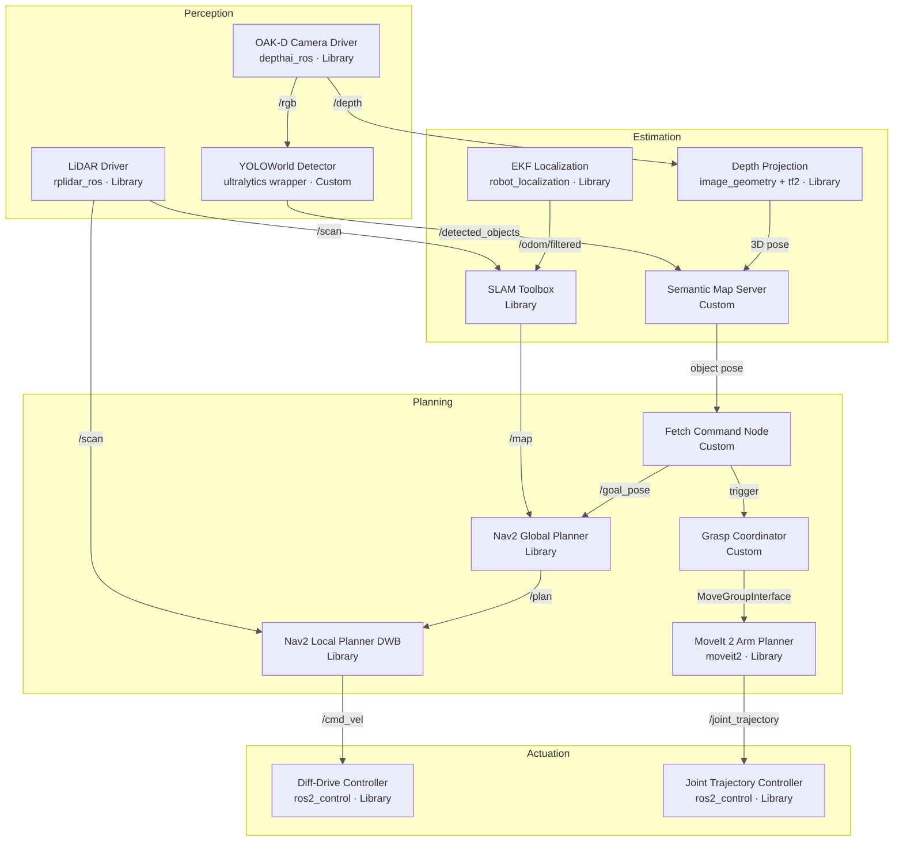
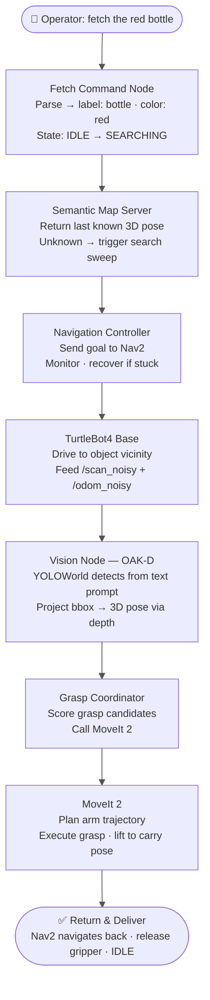

# 🤖 Semantic Fetch Robot (ROS 2)

<div align="center">


**Team: Point Cloud Nine · RAS 598 Mobile Robotics · Arizona State University**

*A ROS 2 mobile manipulation system that accepts natural-language object requests, navigates a simulated warehouse environment, locates targets using open-vocabulary vision, and physically retrieves them using a mounted robotic arm.*

[Overview](#project-overview) • [Problem](#the-problem-we-are-solving) • [Architecture](#system-architecture) • [Components](#key-components) • [Milestone 1](#milestone-1--completed) • [Roadmap](#milestone-roadmap) • [Setup](#quick-start) • [Results](#expected-results)

</div>

---

## Table of Contents

1. [Project Overview](#project-overview)
2. [The Problem We Are Solving](#the-problem-we-are-solving)
3. [System Architecture](#system-architecture)
4. [Key Components](#key-components)
5. [Simulation Environment](#simulation-environment)
6. [Robot Hardware](#robot-hardware)
7. [Open-Source Stack — Build vs Reuse](#open-source-stack--build-vs-reuse)
8. [Technical Specifications](#technical-specifications)
9. [Milestone 1 — Completed](#milestone-1--completed)
10. [Milestone Roadmap](#milestone-roadmap)
11. [Package Structure](#package-structure)
12. [Quick Start](#quick-start)
13. [Expected Results](#expected-results)
14. [Team](#team)
15. [License](#license)

---

<a name="project-overview"></a>
## 🧭 Project Overview

The **Semantic Fetch Robot** is a full-stack autonomous mobile manipulation system built on **ROS 2 Jazzy Jalisco**. It operates inside a **Gazebo Harmonic** simulated depot warehouse and responds to free-text commands from a human operator — for example, *"fetch the red bottle"* — executing the entire fetch pipeline on its own: navigate to the object, see it, pick it up, and return it to the operator.

The system unifies four distinct robotics disciplines into one tightly integrated pipeline:

- **Natural language understanding** — parsing what the operator wants into a structured semantic query
- **SLAM-based autonomous navigation** — building and using a live map of the environment to move safely
- **Open-vocabulary visual detection** — finding objects described in free text without a fixed class list
- **Robotic arm manipulation** — planning and executing a collision-free grasp and return

The hardware platform is a **TurtleBot4** base (iRobot Create 3 differential drive) with an **OpenMANIPULATOR-X** arm mounted on the top plate, an **OAK-D stereo RGB-D camera** for vision, and an **RPLIDAR A1** for 2D environment sensing.

> **This repository currently contains the initial package setup and two foundational ROS 2 nodes, developed as part of Milestone 1.**

> **Success Criterion:** The robot correctly identifies, grasps, and delivers the requested object in **≥ 75% of trials** within the pre-mapped depot world, with zero collisions and each run completing within **180 seconds**.

---

<a name="the-problem-we-are-solving"></a>
## 🎯 The Problem We Are Solving

Most indoor mobile robots today excel at exactly one thing — either navigating autonomously OR picking objects up. Very few can do both in a coordinated way, and even fewer can take a natural-language command and act on it without the object being pre-registered in a fixed database.

The gap we are closing is called **Semantic Fetch**:

| Step | What the robot must do | Why it's hard |
|---|---|---|
| **1. Understand** | Parse *"fetch the red bottle"* into a structured goal | Free text is ambiguous; robots need structured inputs |
| **2. Remember** | Know where it last saw that object, or search intelligently | Environments are large; scanning everything every time is slow |
| **3. Navigate** | Move from current position to object location safely | Dynamic obstacles, narrow corridors, no GPS indoors |
| **4. Detect** | Find the object even if never explicitly programmed | Traditional detectors fail on unseen object classes |
| **5. Grasp** | Compute a valid grasp and execute without dropping | RGB-D depth is noisy; arm workspace is constrained |
| **6. Deliver** | Return to the operator without collision | Arm is carrying an object, changing robot dynamics |

### Why Simulation First?

Gazebo Harmonic gives us a physically accurate simulation where we can:

- Run 20+ fetch trials per hour and measure success rates statistically
- Inject controlled sensor noise via `noise_injector_node` to approximate real-world degradation
- Safely identify failure modes — collisions, failed grasps, detection errors — without hardware damage
- Prove the pipeline end-to-end before sim-to-real transfer

### Real-World Impact

| Domain | Use Case |
|---|---|
| 🏥 Healthcare | Delivering medications, tools, or supplies in hospitals |
| 🏭 Warehousing | Autonomous item retrieval without barcodes or fixed pick stations |
| 🏠 Assistive Living | Supporting elderly or mobility-impaired people at home |
| 🔬 Laboratory | Fetching reagents or instruments on verbal request |
| 🏫 Education | Live demonstration of integrated robotics for research and teaching |

---

<a name="system-architecture"></a>
## 🏗 System Architecture

The system is organized into four layers. Each layer owns one responsibility and is implemented as one or more ROS 2 nodes communicating over topics and services.

### Layer Overview



### End-to-End Fetch Sequence



---

<a name="key-components"></a>
## 🔧 Key Components

### 1. 🗣️ Fetch Command Node *(custom — M2)*

Receives plain-text operator commands and converts them into structured semantic queries. Owns the mission state machine: `IDLE → SEARCHING → NAVIGATING → GRASPING → RETURNING → DONE`.

### 2. 🗺️ Semantic Map Server *(custom — M4)*

Persistent memory of the environment. Wraps the SLAM occupancy grid with a live object registry — every detection is logged with its 3D position, confidence score, and timestamp. Exposes a `/query_object_location` service so any node can ask *"where is the bottle?"*

### 3. 👁️ Vision Node — Open-Vocabulary Detection *(custom — M3)*

Runs **YOLOWorld-L** on OAK-D camera stream using the operator's text as a live prompt. Unlike traditional detectors locked to 80 COCO classes, YOLOWorld handles any object described in free text — no retraining needed. Depth projection converts 2D bounding boxes into 3D poses via `image_geometry` + `tf2`.

### 4. 🧭 Navigation Controller *(Nav2 — M2)*

Full Nav2 stack: NavFn global planner + DWB local planner + layered costmaps (LiDAR inflation + RGB-D voxel layer). Structured recovery chain: Spin → Back-up → Clear costmap → Re-plan → Abort.

### 5. 🏗️ Noise Injector Node *(custom — M1 ✅)*

Injects Gaussian noise onto `/scan` and `/odom` to simulate real-world sensor degradation from day one. All downstream nodes consume `/scan_noisy` and `/odom_noisy`. Noise parameters configurable as ROS 2 params at launch.

### 6. 🦾 Grasp Coordinator + MoveIt 2 *(custom + library — M5)*

Samples grasp pose candidates from the RGB-D point cloud, scores them by reachability + collision clearance + approach angle, then calls MoveIt 2 (RRTConnect, OMPL) for collision-free trajectory planning and `ros2_control` execution.

---

<a name="simulation-environment"></a>
## 🌐 Simulation Environment

We use **Gazebo Harmonic** with the TurtleBot4 **`depot.sdf`** warehouse world.

| Reason | Detail |
|---|---|
| Ships pre-built | No custom world authoring needed |
| Pre-built map | `depot.yaml` enables Nav2 localization from day one |
| Representative layout | Corridors + shelving match real service-robot environments |
| Right scale | Non-trivial navigation; runs on a single dev machine |

**Object placement evolves across milestones:**

| Milestone | Strategy |
|---|---|
| M1 – M2 | Fixed SDF `<include>` locations |
| M3 – M4 | Varied positions within defined zones |
| M5 – M6 | Randomized positions + orientations + partial occlusion |

---

<a name="robot-hardware"></a>
## 🤖 Robot Hardware

| Component | Spec |
|---|---|
| **Base** | TurtleBot4 — iRobot Create 3 differential drive |
| **Arm** | OpenMANIPULATOR-X — 4-DOF serial chain + parallel gripper |
| **Arm reach** | ~390 mm · Max payload ~500 g |
| **Arm actuators** | DYNAMIXEL XM430-W350 (×4) |
| **Vision** | OAK-D Spatial AI Stereo Camera — 1080p RGB + aligned depth |
| **LiDAR** | RPLIDAR A1 — 0.15–12 m range · 360° · 10 Hz |
| **IMU** | Onboard Create 3 IMU |

**URDF Integration:** The OpenMANIPULATOR-X is natively designed for TurtleBot3. We compose a combined URDF using `<xacro:include>` and attach the arm to the TurtleBot4 top plate via a fixed joint with tuned origin offsets.

---

<a name="open-source-stack--build-vs-reuse"></a>
## 📦 Open-Source Stack — Build vs Reuse

| Capability | Package | Decision |
|---|---|---|
| SLAM / Mapping | `slam_toolbox` | ✅ Reuse |
| EKF Localization | `robot_localization` | ✅ Reuse |
| Navigation | `nav2` | ✅ Reuse |
| Object Detection | YOLOWorld (`ultralytics`) | 🔄 Reuse + wrap |
| Arm Motion Planning | `moveit2` + `open_manipulator_x_moveit_config` | ✅ Reuse |
| Arm URDF | `open_manipulator_x_description` | ✅ Reuse |
| Depth Projection | `image_geometry` + `tf2` | ✅ Reuse |
| Hardware abstraction | `ros2_control` | ✅ Reuse |
| Semantic Map | Custom `semantic_map_server` | 🔨 Custom |
| Command Parser | Custom `fetch_command_node` | 🔨 Custom |
| Grasp Coordinator | Custom `grasp_coordinator_node` | 🔨 Custom |
| Noise Injection | Custom `noise_injector_node` | 🔨 Custom |

---

<a name="technical-specifications"></a>
## 📊 Technical Specifications

| Parameter | Value |
|---|---|
| **Robot Platform** | TurtleBot4 (iRobot Create 3) + OpenMANIPULATOR-X |
| **Kinematic Model — Base** | Differential drive |
| **Kinematic Model — Arm** | Serial chain, 4 revolute joints + parallel gripper |
| **Primary Sensors** | OAK-D Spatial AI Stereo Camera · RPLIDAR A1 · IMU |
| **Simulator** | Gazebo Harmonic (`gz-harmonic`) |
| **Simulation World** | `depot.sdf` — TurtleBot4 depot warehouse world |
| **ROS Version** | ROS 2 Jazzy Jalisco |
| **OS** | Ubuntu 24.04 LTS |
| **Detection Model** | YOLOWorld-L (primary) · CLIP ViT-B/32 (fallback) |
| **Navigation Stack** | Nav2 + SLAM Toolbox |
| **Motion Planner** | MoveIt 2 + OMPL (RRTConnect) |
| **Controller** | `ros2_control` JointTrajectoryController |
| **Max Base Speed** | 0.22 m/s |
| **Arm Max Reach** | 390 mm |
| **Target Detection Speed** | ≥ 10 FPS on host CPU |
| **Target Success Rate** | ≥ 75% across 10 fetch trials |
| **Max Task Time** | 180 seconds per run |

---

<a name="milestone-1--completed"></a>
## ✅ Milestone 1 — Completed

**Focus:** Foundational ROS 2 package scaffolding and two verified node prototypes.

### Checklist

| Item | Status |
|---|---|
| ROS 2 Python package initialized | ✅ |
| `package.xml` with all dependencies declared | ✅ |
| `setup.py` / `setup.cfg` configured | ✅ |
| `semantic_fetch_node` — builds, spins, publishes `/fetch_status` | ✅ |
| `noise_injector_node` — subscribes, injects noise, republishes | ✅ |
| `colcon build` — zero errors, zero warnings | ✅ |
| `colcon test` — flake8, pep257, copyright all green | ✅ |
| GitHub repository initialized on `main` | ✅ |

### Node 1: `semantic_fetch_node.py`

The verified scaffold for the fetch pipeline. Confirms the package builds, the node lifecycle works, and the topic namespace is established. Evolves into `fetch_command_node.py` in M2 with full NLP parsing and state machine logic.

```python
class SemanticFetchNode(Node):
    def __init__(self):
        super().__init__('semantic_fetch_node')
        self.publisher_ = self.create_publisher(String, 'fetch_status', 10)
        self.timer = self.create_timer(1.0, self.timer_callback)
        self.get_logger().info('Semantic Fetch Node initialized — IDLE.')

    def timer_callback(self):
        msg = String()
        msg.data = 'SemanticFetchRobot: IDLE — Awaiting fetch command'
        self.publisher_.publish(msg)
```

**Published:** `/fetch_status` → `std_msgs/String` @ 1 Hz · **Deps:** `rclpy`, `std_msgs` only

### Node 2: `noise_injector_node.py`

Injects Gaussian noise onto `/scan` and `/odom` so the pipeline is stress-tested under near-real-world conditions from day one. All downstream nodes consume `/scan_noisy` and `/odom_noisy`.

```python
class NoiseInjectorNode(Node):
    def __init__(self):
        super().__init__('noise_injector_node')
        self.declare_parameter('lidar_noise_std', 0.02)   # metres
        self.declare_parameter('odom_noise_std',  0.005)  # metres / radians
        self.scan_sub = self.create_subscription(LaserScan, '/scan', self.scan_cb, 10)
        self.odom_sub = self.create_subscription(Odometry,  '/odom', self.odom_cb, 10)
        self.scan_pub = self.create_publisher(LaserScan, '/scan_noisy', 10)
        self.odom_pub = self.create_publisher(Odometry,  '/odom_noisy', 10)
```

**Subscribes:** `/scan`, `/odom` · **Publishes:** `/scan_noisy`, `/odom_noisy`

---

<a name="milestone-roadmap"></a>
## 🗺️ Milestone Roadmap

| Milestone | Focus | Key Deliverable | Acceptance Criteria |
|---|---|---|---|
| **M1** ✅ | Package scaffold + noise injection | 2 working ROS 2 nodes | `colcon build` passes · nodes spin · noise injected |
| **M2** | SLAM + Nav2 navigation | Pre-mapped depot + waypoint nav | Robot reaches 3 waypoints without collision |
| **M3** | Open-vocabulary vision | YOLOWorld detection node live | Detects 5 objects from text prompt at ≥ 10 FPS |
| **M4** | Semantic mapping | Object registry + query service | Object pose returned within 0.15 m of ground truth |
| **M5** | Arm grasping | MoveIt 2 pick in isolation | Successful grasp in ≥ 3 / 5 trials |
| **M6** | Full integration | End-to-end fetch pipeline | Command → pick → return ≥ 75% success |

---

<a name="package-structure"></a>
## 📁 Package Structure

```
semantic_fetch_robot/
├── README.md                          ← You are here
├── milestone1.md                      Milestone 1 detailed report
├── _config.yml                        GitHub Pages configuration
├── index.md                           Project website index
├── package.xml                        ROS 2 package manifest
├── setup.py                           Entry point registration
├── setup.cfg                          Python build configuration
├── launch/
│   └── bringup.launch.py              Full system launch (M2+)
├── config/
│   ├── nav2_params.yaml               Nav2 stack tuning (M2+)
│   └── moveit_params.yaml             MoveIt 2 arm planning config (M5+)
├── resource/
│   └── semantic_fetch_robot           ament resource index marker
├── semantic_fetch_robot/
│   ├── __init__.py
│   ├── semantic_fetch_node.py         ✅ M1 — Heartbeat + state machine scaffold
│   ├── noise_injector_node.py         ✅ M1 — Gaussian noise on LiDAR + odometry
│   ├── fetch_command_node.py          🔜 M2 — NLP command parser → fetch goal
│   ├── navigation_controller_node.py  🔜 M2 — Nav2 action client + recovery
│   ├── vision_node.py                 🔜 M3 — YOLOWorld + OAK-D depth projection
│   ├── semantic_map_node.py           🔜 M4 — Object registry + query service
│   └── grasp_coordinator_node.py      🔜 M5 — Grasp scoring + MoveIt 2 interface
└── test/
    ├── test_copyright.py              Apache license header checks
    ├── test_flake8.py                 PEP 8 style enforcement
    ├── test_pep257.py                 Docstring convention checks
    └── test_node.py                   Node lifecycle integration test
```

---

<a name="quick-start"></a>
## 🚀 Quick Start

### Prerequisites

```bash
# ROS 2 Jazzy
sudo apt install ros-jazzy-desktop

# Gazebo Harmonic + TurtleBot4
sudo apt install gz-harmonic ros-jazzy-turtlebot4-simulator

# Navigation + SLAM
sudo apt install ros-jazzy-nav2-bringup ros-jazzy-slam-toolbox

# Motion Planning
sudo apt install ros-jazzy-moveit

# OpenMANIPULATOR-X
sudo apt install ros-jazzy-open-manipulator-x-description

# ros2_control
sudo apt install ros-jazzy-ros2-control ros-jazzy-ros2-controllers
```

### Build

```bash
mkdir -p ~/ros2_ws/src && cd ~/ros2_ws/src
git clone https://github.com/suyash-asu/semantic_fetch_robot.git

cd ~/ros2_ws
rosdep install --from-paths src --ignore-src -r -y
colcon build --symlink-install
source install/setup.bash
```

### Run Milestone 1

```bash
# Terminal 1 — fetch scaffold node
ros2 run semantic_fetch_robot semantic_fetch_node

# Terminal 2 — noise injector
ros2 run semantic_fetch_robot noise_injector_node \
    --ros-args -p lidar_noise_std:=0.02 -p odom_noise_std:=0.005

# Monitor heartbeat
ros2 topic echo /fetch_status

# Verify noise is applied
ros2 topic echo /scan_noisy
```

### Run Tests

```bash
colcon test --packages-select semantic_fetch_robot
colcon test-result --verbose
```

### Launch Full Simulation *(M2+)*

```bash
ros2 launch turtlebot4_gz_bringup turtlebot4_gz.launch.py \
    world:=depot slam:=true nav2:=true rviz:=true
```

---

<a name="expected-results"></a>
## 📈 Expected Results

### Evaluation Protocol

1. Robot initialized at depot world origin, arm in home position
2. Text command issued: `"fetch the [object_name]"`
3. Object placed 3–5 m from start (fixed M1–M4, randomized M5–M6)
4. **Success:** object delivered to operator start within 180 s, zero collisions
5. **Failure:** wrong object, collision, timeout, or dropped grasp

### Target Metrics

| Metric | Target |
|---|---|
| End-to-end fetch success rate | ≥ 75% (≥ 8 / 10 trials) |
| Object detection accuracy | ≥ 85% mAP @ IoU 0.5 |
| Navigation collision rate | ≤ 5% of trials |
| Average task completion time | ≤ 90 seconds |
| Arm grasp success rate | ≥ 70% of pick attempts |
| Semantic map pose accuracy | Within 0.15 m of ground truth |

### Test Object Set

`water_bottle` · `coffee_mug` · `cardboard_box` · `soda_can` · `tennis_ball` · `book` · `cup` · `bowl` · `spray_bottle` · `toy_block`

---

<a name="team"></a>
## 👥 Team

**Point Cloud Nine · RAS 598 Mobile Robotics · Group 2 · Arizona State University · 2025**

| Role | Responsibility |
|---|---|
| Navigation Lead | SLAM Toolbox integration · Nav2 config · costmap tuning · recovery behaviors |
| Vision Lead | YOLOWorld / CLIP pipeline · OAK-D DepthAI SDK · 3D depth projection |
| Manipulation Lead | MoveIt 2 setup · grasp pose scoring · JointTrajectoryController execution |
| Integration Lead | ROS 2 node graph · launch files · topic/service interface · end-to-end testing |
| Simulation Lead | Gazebo depot world · SDF object placement · benchmark scripting · noise injection |

---

<a name="license"></a>
## 📄 License

```
Copyright 2025 Point Cloud Nine — RAS 598 Mobile Robotics, Arizona State University

Licensed under the Apache License, Version 2.0 (the "License");
you may not use this file except in compliance with the License.
You may obtain a copy of the License at

    http://www.apache.org/licenses/LICENSE-2.0
```

---

<div align="center">

**Semantic Fetch Robot** · RAS 598 Mobile Robotics · Team: Point Cloud Nine · ASU · 2026

*Built with ROS 2 Jazzy · Gazebo Harmonic · Nav2 · SLAM Toolbox · MoveIt 2 · YOLOWorld · OAK-D · ros2_control*

</div>
