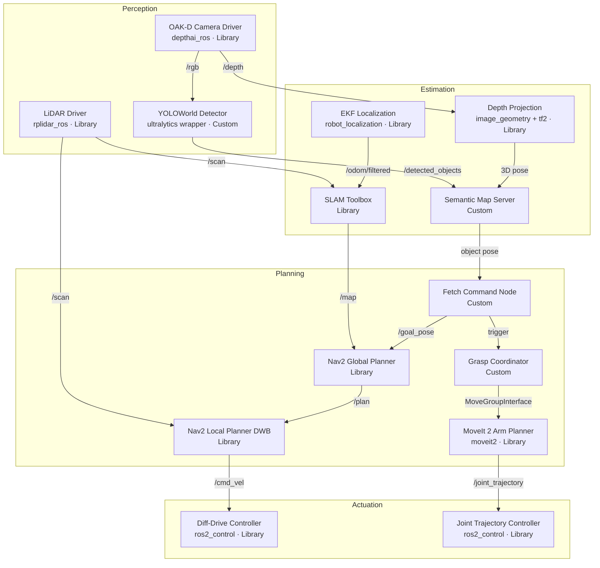

# Milestone 1: Proposal & Architecture
 
Semantic Fetch Robot Milestone 1 defines the initial system design and simulation setup for a ROS 2 mobile manipulator that can interpret natural-language fetch requests, navigate a warehouse-like environment, and retrieve the requested object.

**At a Glance**

- **Goal.** Design and validate a semantic fetch pipeline in simulation.
- **Environment.** Gazebo Harmonic depot warehouse world with a pre-built map.
- **Robot.** TurtleBot4 base with an OpenMANIPULATOR-X arm and RGB-D + LiDAR sensing.
- **Key Capabilities.** Semantic mapping, open-vocabulary object detection, mobile manipulation.
- **Success Criteria.** ≥ 75% fetch success over 10 trials, no collisions, each run under 180 seconds.

**On This Page**

- [1. Mission Statement & Scope](#1-mission-statement--scope)
- [2. Background & Prior Work](#2-background--prior-work)
- [3. Technical Specifications](#3-technical-specifications)
- [4. Simulation Environment](#4-simulation-environment)
- [5. Robot Arm Integration](#5-robot-arm-integration)
- [6. Open-Source Stack & Build vs. Reuse Decisions](#6-open-source-stack--build-vs-reuse-decisions)
- [7. High-Level System Architecture](#7-high-level-system-architecture)
- [8. Package Structure](#8-package-structure)

---

## 1. Mission Statement & Scope

The **Semantic Fetch Robot** is a mobile manipulation system that connects natural-language commands from a human operator with autonomous robotic retrieval of items. When the operator issues a command such as *"fetch the red bottle"*, the robot must interpret the request, locate the target object, pick it up with its arm, and return it to the operator.

The robot operates in a structured indoor simulation environment that resembles a small warehouse. Within this space it performs end-to-end fetch behaviors that combine navigation, perception, and manipulation.

- **Environment.** The simulation takes place in a pre-generated TurtleBot world with shelving, walls, and corridors that approximate a warehouse. Gazebo's SDF model feature allows us to place objects at specific, repeatable locations.
- **Primary problem.** Many indoor robots can either navigate or manipulate, but not both in a coordinated way. The Semantic Fetch Robot explicitly coordinates navigation and manipulation based on a semantic command, requiring tight integration of perception, mapping, planning, and control.
- **Success criteria.** ≥ 75% object fetch success rate over 10 trials, no collisions, and each task completed within 180 seconds per run in a pre-mapped environment.

---

## 2. Background & Prior Work

Our project sits at the intersection of three active research areas: semantic mapping, open-vocabulary object detection, and mobile manipulation. The following prior work shapes our design choices.

### Mobile Manipulation / Fetch Robots

The RoboCup@Home competition has driven the development of fetch-capable service robots for over a decade. Common architectures follow a map → localize → detect → plan → grasp pipeline, which we adopt. Prior work also shows that decoupling navigation from manipulation, with separate planners coordinated through a task layer, is typically more robust than tightly coupled controllers.

**Implication for our project.** We retain distinct navigation and arm planners, coordinated by a task-level fetch behavior.

### Open-Vocabulary Object Detection

Traditional YOLO models rely on a fixed class list, limiting their usefulness when a user can request arbitrary objects. Recent open-vocabulary models address this. **CLIP** (Radford et al., OpenAI, 2021) demonstrated that aligning visual and textual embeddings enables zero-shot recognition of new classes. **YOLOWorld** (Cheng et al., 2024) integrates CLIP-style text encoders directly into the YOLO architecture, enabling open-vocabulary detection at real-time speeds suitable for embedded compute. The **OpenNav** framework (arxiv:2408.13936) combines YOLOWorld and MobileSAM in a ROS 2 pipeline for open-vocabulary 3D object detection tightly integrated with navigation.

**Implication for our project.** We adopt YOLOWorld with a thin ROS 2 wrapper to support free-text object requests.

### Semantic Mapping

ConceptGraphs (Gu et al., 2023) and DualMap (2025) demonstrate how to lift 2D image detections into 3D and maintain a queryable map of objects. DualMap, in particular, implements this idea in a ROS 2 pipeline using a wheeled robot with LiDAR and RGB-D sensing, which closely matches our hardware setup.

**Implication for our project.** We follow a similar pattern and maintain a semantic object registry that can be queried by label and pose.

### SLAM & Navigation

For 2D mapping, SLAM Toolbox is the official ROS 2 SLAM package. For navigation, Nav2 provides an action server, layered costmaps, and recovery behaviors. Both packages have been tested extensively with the TurtleBot simulator and are well-supported in ROS 2 Jazzy.

**Implication for our project.** We reuse SLAM Toolbox and Nav2 with minimal customization for the depot world.

### MoveIt 2 for Arm Control

MoveIt 2 is the standard ROS 2 motion planning framework. The `open_manipulator_x_moveit_config` package (ROBOTIS) provides a pre-built configuration for the OpenMANIPULATOR-X, including URDF, SRDF, joint limits, and IK solver setup.

**Implication for our project.** We reuse the existing MoveIt 2 configuration to avoid re-deriving kinematics and planning parameters.

---

## 3. Technical Specifications

| Parameter | Value |
|---|---|
| **Robot Platform** | TurtleBot4 |
| **Mounted Arm** | OpenMANIPULATOR-X (4-DOF + gripper, DYNAMIXEL XM430) |
| **Kinematic Model (Base)** | Differential drive (iRobot Create 3) |
| **Kinematic Model (Arm)** | Serial chain, 4 revolute joints + parallel gripper |
| **Sensors** | OAK-D Spatial AI stereo camera, RPLIDAR A1 2D LiDAR, IMU |
| **Simulator** | Gazebo Harmonic (`gz-harmonic`) |
| **Simulation World** | `depot.sdf` (TurtleBot4 default depot warehouse world) |
| **ROS Version** | ROS 2 Jazzy Jalisco |
| **OS** | Ubuntu 24.04 LTS |

---

## 4. Simulation Environment

We use **Gazebo Harmonic** (`gz-harmonic`), the officially supported simulator for ROS 2 Jazzy and the TurtleBot4 platform. The TurtleBot simulator package (`ros-jazzy-turtlebot4-simulator`) ships with built-in support for Gazebo Harmonic and provides an out-of-the-box simulation launch for SLAM, Nav2, and RViz.

To run the baseline simulation:

```bash
sudo apt install gz-harmonic ros-jazzy-turtlebot4-simulator
ros2 launch turtlebot4_gz_bringup turtlebot4_gz.launch.py \
    slam:=true nav2:=true rviz:=true
```

**Chosen World: `depot.sdf`.** This is the default TurtleBot4 depot warehouse world. It was selected because:
- It ships pre-built with `turtlebot4-simulator`, avoiding custom world authoring.
- A pre-built map (`depot.yaml`) is available, enabling Nav2 localization from day one.
- The warehouse layout (corridors, open shelving areas) is representative of real service-robot environments.
- The map is large enough to make navigation non-trivial but small enough to run on a single development machine.

**Object placement.** Target objects (bottles, cans, small boxes from the Gazebo Fuel model database) are spawned at fixed, known locations using SDF `<include>` tags. This eliminates random placement variability for early milestones and simplifies debugging. In Milestone 3, we will introduce varied placement patterns to test robustness.

---

## 5. Robot Arm Integration

**Platform compatibility note.** The OpenMANIPULATOR-X is natively designed for TurtleBot3 (Waffle/Waffle Pi). TurtleBot4 uses a different base (iRobot Create 3) and does not ship with an official combined URDF for TB4 + OpenMANIPULATOR-X.

**URDF integration strategy.** We compose a combined robot description by:

- Extending the TurtleBot4 URDF using a `<xacro:include>` for the OpenMANIPULATOR-X description from the `open_manipulator_x_description` package.
- Attaching the arm to the TurtleBot4 top mounting plate via a fixed joint.
- Tuning the joint origin offset to match the physical mounting position.

This mirrors the composition pattern used in the TurtleBot3 manipulation packages.

**Key packages used**

| Package | Source | Purpose |
|---|---|---|
| `turtlebot4_description` | `ros-jazzy-turtlebot4` | TurtleBot4 base URDF/xacro |
| `open_manipulator_x_description` | ROBOTIS GitHub (jazzy branch) | Arm URDF and mesh files |
| `open_manipulator_x_moveit_config` | ROBOTIS GitHub | Pre-built MoveIt 2 config, IK solver, SRDF |
| `ros2_control` | apt | Hardware abstraction layer for arm joints |
| `moveit2` | `ros-jazzy-moveit` | Motion planning framework |

**Simulation arm control.** In Gazebo Harmonic, arm joints are controlled via the `ros2_control` Gazebo plugin using a `JointTrajectoryController`. The MoveIt 2 `moveit_gazebo.launch.py` from `open_manipulator_x_moveit_config` launches the planning context and bridges it to the simulation controllers. Grasp execution uses MoveIt's `MoveGroupInterface` to plan and execute a pre-computed approach and grasp trajectory.

**Grasp pose estimation.** The OAK-D camera provides both RGB and registered depth. After the object detector produces a 2D bounding box, we project the centroid pixel through the depth map to obtain a 3D point in the camera frame. This 3D point is transformed to the `base_link` frame using `tf2` and used as the target for a top-down grasp pose. MoveIt 2 solves IK for the approach and grasp configurations.

---

## 6. Open-Source Stack & Build vs. Reuse Decisions

Our guiding principle is to **reuse well-maintained open-source packages wherever possible** and implement custom code only where integration or new functionality is required.

Legend:
- **Reuse** — use as-is with configuration only.
- **Reuse (wrap)** — use as-is behind a thin custom wrapper.
- **Custom** — implement from scratch for this project.

| Capability | Chosen Open-Source Package | Decision | Rationale |
|---|---|---|---|
| SLAM / Mapping | `slam_toolbox` (ROS 2 Jazzy) | **Reuse** | Ships with TurtleBot, stable and well-documented |
| EKF Localization | `robot_localization` | **Reuse** | Industry standard for mobile-robot sensor fusion |
| Navigation | `nav2` | **Reuse** | Standard ROS 2 navigation stack |
| Object Detection | YOLOWorld (`ultralytics`) | **Reuse (wrap)** | Open-vocabulary, real-time, Python API available |
| Arm Motion Planning | `moveit2` + `open_manipulator_x_moveit_config` | **Reuse** | Full IK/planning config pre-built by ROBOTIS |
| Arm URDF | `open_manipulator_x_description` | **Reuse** | Official ROBOTIS description package |
| Depth Projection | `image_geometry` + `tf2` | **Reuse** | Standard ROS 2 perception utilities |
| Semantic Map | Custom `semantic_map_server` node | **Custom** | No standard ROS 2 package for queryable semantic object registries |
| Command Parser | Custom `fetch_command_node` | **Custom** | Bridges text input → object label → Nav2 goal |
| Grasp Coordinator | Custom `grasp_coordinator_node` | **Custom** | Integrates detection pose → MoveIt 2 grasp execution |

The highest-risk components are the custom semantic map server, command parser, and grasp coordinator, since they define the project-specific glue between perception, navigation, and manipulation.

---

## 7. High-Level System Architecture

The system follows a **Perception → Estimation → Planning → Actuation** flow with two additional coordination layers: a **Semantic Layer** that maintains the object registry, and a **Task Layer** that sequences the full fetch behavior (navigate → detect → grasp → return).

**Control strategy summary.** The base uses Nav2's velocity smoother outputting to `/cmd_vel`, translated to wheel commands by the iRobot Create 3 firmware. The arm uses a `ros2_control` `JointTrajectoryController`, commanded by MoveIt 2 via the `FollowJointTrajectory` action. The two controllers operate independently; the base is explicitly stopped before arm motion begins to avoid destabilizing the platform.

**Fetch task sequence.** At a high level, the system executes the following steps:

1. Receive a natural-language fetch command (e.g., via a text UI) in the `fetch_command_node`.
2. Query the semantic map for the most likely pose of the requested object.
3. Use Nav2 to plan and navigate to a base pose near the object.
4. Refine the object pose using YOLOWorld detections and depth projection from the OAK-D camera.
5. Stop the base and execute an arm approach and grasp trajectory via MoveIt 2.
6. Return to the operator's starting pose and release the object.


---

## 8. Package Structure

The ROS 2 package is organized as follows:

```
semantic_fetch_robot/
├── package.xml
├── setup.py
├── setup.cfg
├── README.md
├── launch/
│   └── bringup.launch.py
├── config/
│   ├── nav2_params.yaml
│   └── moveit_params.yaml
├── semantic_fetch_robot/
│   ├── __init__.py
│   ├── semantic_fetch_node.py
│   └── noise_injector_node.py
└── test/
    └── test_node.py
```

### Milestone 1 Nodes

`semantic_fetch_node.py` is the starting point for the fetch pipeline.

Its responsibilities in Milestone 1 are to:

- Initialize the ROS 2 node and publisher infrastructure.
- Periodically publish heartbeats on the `/fetch_status` topic to confirm that the package is being built and run correctly within the workspace.

In the current architecture, `semantic_fetch_node.py` is the predecessor to the eventual `fetch_command_node`. Creating this initial skeleton:

- Establishes a clear naming convention for the main node.
- Defines a consistent topic namespace for nodes in this package.
- Provides an early prototype of the operator status feedback channel.

As the project progresses to later milestones, `/fetch_status` will carry richer information about the robot's task state (navigating, detecting, grasping, returning). The `semantic_fetch_node.py` implementation is entirely custom, built with `rclpy` and depending only on core ROS 2 libraries.

`noise_injector_node.py` is the second custom node. Because the entire project runs in simulation, Gazebo provides idealized sensor data that is free of environmental noise. To approximate real-world conditions, this node:

- Subscribes to `/scan` and `/odom`.
- Injects Gaussian noise into LiDAR ranges and odometry pose estimates.
- Publishes the noisy data on `/scan_noisy` and `/odom_noisy`.

All downstream nodes consume the noisy topics instead of the raw simulated data. The noise parameters (mean and standard deviation) are exposed as ROS 2 parameters, allowing the noise profile to be adjusted at launch time without code changes.
