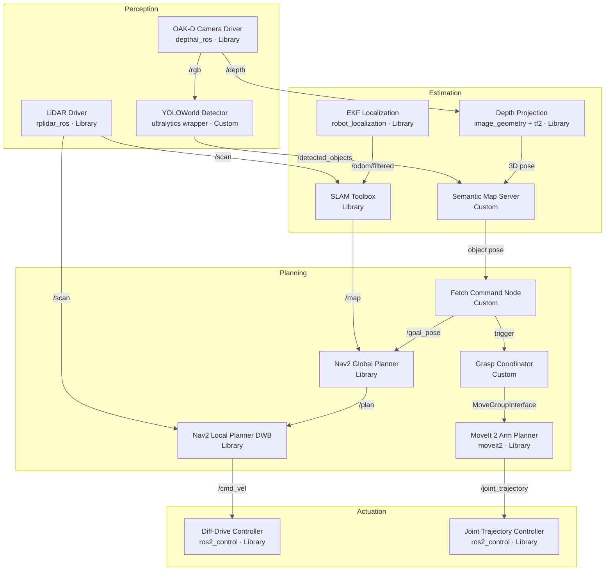

# Milestone 1: Proposal & Architecture
**Team:** Point Cloud Nine · RAS 598 · ASU

> Semantic Fetch Robot — Milestone 1 defines the full system design, simulation setup, and foundational ROS 2 package for a mobile manipulator that interprets natural-language fetch requests, navigates a warehouse-like environment, and retrieves the requested object.

---

## At a Glance

| | |
|---|---|
| 🎯 **Goal** | Design and validate a semantic fetch pipeline in simulation |
| 🌐 **Environment** | Gazebo Harmonic depot warehouse world with a pre-built map |
| 🤖 **Robot** | TurtleBot4 base + OpenMANIPULATOR-X arm + RGB-D + LiDAR |
| 🧠 **Key Capabilities** | Semantic mapping · Open-vocabulary detection · Mobile manipulation |
| ✅ **Success Criteria** | ≥ 75% fetch success over 10 trials · No collisions · Each run ≤ 180 s |

---

## On This Page

- [1. Mission Statement & Scope](#1-mission-statement--scope)
- [2. Background & Prior Work](#2-background--prior-work)
- [3. Technical Specifications](#3-technical-specifications)
- [4. Simulation Environment](#4-simulation-environment)
- [5. Robot Arm Integration](#5-robot-arm-integration)
- [6. Open-Source Stack & Build vs. Reuse Decisions](#6-open-source-stack--build-vs-reuse-decisions)
- [7. High-Level System Architecture](#7-high-level-system-architecture)
- [8. Package Structure](#8-package-structure)
- [9. Milestone 1 Nodes](#9-milestone-1-nodes)
- [10. Running Milestone 1](#10-running-milestone-1)

---

## 1. Mission Statement & Scope

The **Semantic Fetch Robot** is a mobile manipulation system that connects natural-language commands from a human operator with autonomous robotic retrieval of items. When the operator issues a command such as *"fetch the red bottle"*, the robot must:

1. **Interpret** the natural-language request into a structured goal
2. **Locate** the target object using a semantic map and open-vocabulary vision
3. **Navigate** autonomously through the warehouse environment
4. **Pick up** the object using the mounted arm
5. **Return** the object to the operator's starting position

### Environment

The simulation takes place in a pre-generated TurtleBot4 depot world with shelving, walls, and corridors that approximate a real warehouse. Gazebo's SDF model feature allows objects to be placed at specific, repeatable locations — eliminating variability during early-milestone testing.

### Primary Problem

Many indoor robots can either navigate **or** manipulate, but not both in a coordinated, semantically-driven way. The Semantic Fetch Robot explicitly bridges this gap by coordinating navigation and manipulation in response to a free-text command — requiring tight integration of perception, mapping, planning, and control across a unified ROS 2 pipeline.

### Success Criteria

| Criterion | Target |
|---|---|
| Object fetch success rate | ≥ 75% over 10 trials |
| Collision events | 0 per run |
| Task completion time | ≤ 180 seconds per run |
| Detection accuracy | ≥ 85% mAP @ IoU 0.5 |
| Grasp success rate | ≥ 70% of pick attempts |

---

## 2. Background & Prior Work

Our project sits at the intersection of three active research areas: semantic mapping, open-vocabulary object detection, and mobile manipulation. The following prior work directly shapes our design choices.

### 2.1 Mobile Manipulation & Fetch Robots

The RoboCup@Home competition has driven fetch-capable service robot development for over a decade. Winning architectures consistently follow a:

```
map → localize → detect → plan → grasp
```

pipeline — which we adopt directly. Prior work also shows that **decoupling navigation from manipulation**, with separate planners coordinated through a task layer, is significantly more robust than tightly coupled controllers.

> **Implication for our project:** We retain distinct navigation and arm planners (Nav2 and MoveIt 2), coordinated by a task-level `fetch_command_node`.

---

### 2.2 Open-Vocabulary Object Detection

Traditional YOLO models rely on a fixed class list — a fundamental limitation when a user can request arbitrary objects. Recent models address this:

| Model | Contribution | Relevance |
|---|---|---|
| **CLIP** (OpenAI, 2021) | Aligns visual and textual embeddings for zero-shot recognition | Theoretical foundation for text-driven detection |
| **YOLOWorld** (2024) | Integrates CLIP-style text encoders into YOLO — real-time open-vocabulary detection | **Primary detector in our pipeline** |
| **OpenNav** (arXiv:2408.13936) | Combines YOLOWorld + MobileSAM in a ROS 2 pipeline for 3D open-vocabulary detection | Closest prior work to our full system |

> **Implication for our project:** We adopt YOLOWorld with a thin ROS 2 wrapper (`vision_node.py`) to support free-text object requests without retraining.

---

### 2.3 Semantic Mapping

ConceptGraphs (Gu et al., 2023) and DualMap (2025) demonstrate how to lift 2D image detections into 3D and maintain a queryable semantic map. DualMap, in particular, implements this in a ROS 2 pipeline with a wheeled robot using LiDAR and RGB-D — closely matching our setup.

> **Implication for our project:** We follow a similar pattern: a custom `semantic_map_server` node maintains a confidence-weighted, queryable object registry layered on top of the SLAM occupancy grid.

---

### 2.4 SLAM & Navigation

SLAM Toolbox is the official ROS 2 SLAM package; Nav2 provides the action server, layered costmaps, and recovery behaviors. Both are extensively tested with TurtleBot simulators and fully supported in ROS 2 Jazzy.

> **Implication for our project:** Reuse SLAM Toolbox and Nav2 with minimal configuration for the depot world.

---

### 2.5 MoveIt 2 for Arm Control

MoveIt 2 is the standard ROS 2 motion planning framework. The `open_manipulator_x_moveit_config` package (ROBOTIS) provides a pre-built configuration for the OpenMANIPULATOR-X, including URDF, SRDF, joint limits, and IK solver setup.

> **Implication for our project:** Reuse the existing MoveIt 2 configuration to avoid re-deriving kinematics and planning parameters from scratch.

---

## 3. Technical Specifications

| Parameter | Value |
|---|---|
| **Robot Platform** | TurtleBot4 (iRobot Create 3) |
| **Mounted Arm** | OpenMANIPULATOR-X — 4-DOF + gripper (DYNAMIXEL XM430) |
| **Kinematic Model — Base** | Differential drive |
| **Kinematic Model — Arm** | Serial chain, 4 revolute joints + parallel gripper |
| **Arm Max Reach** | ~390 mm from base link |
| **Arm Max Payload** | ~500 g |
| **Primary Sensors** | OAK-D Spatial AI Stereo Camera · RPLIDAR A1 2D LiDAR · IMU |
| **Simulator** | Gazebo Harmonic (`gz-harmonic`) |
| **Simulation World** | `depot.sdf` — TurtleBot4 default depot warehouse world |
| **ROS Version** | ROS 2 Jazzy Jalisco |
| **OS** | Ubuntu 24.04 LTS |
| **Detection Model** | YOLOWorld-L (primary) · CLIP ViT-B/32 (fallback re-ranker) |
| **Navigation Stack** | Nav2 + SLAM Toolbox |
| **Motion Planner** | MoveIt 2 + OMPL (RRTConnect) |
| **Target Detection Speed** | ≥ 10 FPS on host CPU |

---

## 4. Simulation Environment

We use **Gazebo Harmonic** (`gz-harmonic`), the officially supported simulator for ROS 2 Jazzy and the TurtleBot4 platform. The `ros-jazzy-turtlebot4-simulator` package ships with out-of-the-box launch support for SLAM, Nav2, and RViz.

### Launch Baseline Simulation

```bash
sudo apt install gz-harmonic ros-jazzy-turtlebot4-simulator

ros2 launch turtlebot4_gz_bringup turtlebot4_gz.launch.py \
    slam:=true nav2:=true rviz:=true
```

### Why `depot.sdf`?

| Reason | Detail |
|---|---|
| Ships pre-built | No custom world authoring — available immediately with `turtlebot4-simulator` |
| Pre-built map | `depot.yaml` enables Nav2 localization from day one; no per-run mapping phase |
| Representative layout | Corridors + open shelving areas match real service-robot environments |
| Right scale | Large enough for non-trivial navigation; small enough for a single dev machine |

### Object Placement Strategy

| Milestone | Strategy | Rationale |
|---|---|---|
| M1 – M2 | Fixed SDF `<include>` locations | Eliminate variability; focus on pipeline integration |
| M3 – M4 | Varied positions within defined zones | Begin robustness testing |
| M5 – M6 | Randomized positions + orientations + partial occlusion | Full robustness validation |

Target objects (bottles, cans, small boxes) are sourced from the Gazebo Fuel model database and spawned via SDF `<include>` tags.

---

## 5. Robot Arm Integration

### Platform Compatibility Note

The OpenMANIPULATOR-X is natively designed for TurtleBot3 (Waffle/Waffle Pi). TurtleBot4 uses the iRobot Create 3 base and does **not** ship with an official combined URDF for TB4 + OpenMANIPULATOR-X. We compose one.

### URDF Integration Strategy

```
TurtleBot4 base URDF
    └── <xacro:include> open_manipulator_x_description
            └── fixed joint → TurtleBot4 top mounting plate
                    └── origin offset tuned to physical mount position
```

This mirrors the composition pattern used in the TurtleBot3 manipulation packages and keeps our robot description modular — the arm URDF can be swapped independently of the base.

### Key Packages

| Package | Source | Purpose |
|---|---|---|
| `turtlebot4_description` | `ros-jazzy-turtlebot4` | TurtleBot4 base URDF/xacro |
| `open_manipulator_x_description` | ROBOTIS GitHub (jazzy branch) | Arm URDF and mesh files |
| `open_manipulator_x_moveit_config` | ROBOTIS GitHub | Pre-built MoveIt 2 config, IK solver, SRDF |
| `ros2_control` | apt | Hardware abstraction layer for arm joints |
| `moveit2` | `ros-jazzy-moveit` | Motion planning framework |

### Simulation Arm Control

In Gazebo Harmonic, arm joints are controlled via the `ros2_control` Gazebo plugin using a `JointTrajectoryController`. The MoveIt 2 `moveit_gazebo.launch.py` from `open_manipulator_x_moveit_config` launches the planning context and bridges it to the simulation controllers. Grasp execution uses MoveIt's `MoveGroupInterface` to plan and execute the approach and grasp trajectory.

### Grasp Pose Estimation

```
OAK-D RGB frame → YOLOWorld → 2D bounding box
                                     │
                              centroid pixel
                                     │
                              OAK-D depth map → 3D point in camera_frame
                                                        │
                                                   tf2 transform
                                                        │
                                             3D point in base_link frame
                                                        │
                                             top-down grasp pose → MoveIt 2 IK
```

---

## 6. Open-Source Stack & Build vs. Reuse Decisions

Our guiding principle: **reuse well-maintained open-source packages wherever possible. Write custom code only where integration or new functionality is required.**

| Capability | Package | Decision | Rationale |
|---|---|---|---|
| SLAM / Mapping | `slam_toolbox` | ✅ **Reuse** | Official ROS 2 SLAM package; tested with TurtleBot; stable |
| EKF Localization | `robot_localization` | ✅ **Reuse** | Industry standard for mobile-robot sensor fusion |
| Navigation | `nav2` | ✅ **Reuse** | Full action server, layered costmaps, recovery behaviors |
| Object Detection | YOLOWorld (`ultralytics`) | 🔄 **Reuse (wrap)** | Open-vocabulary, real-time; thin ROS 2 wrapper required |
| Arm Motion Planning | `moveit2` + `open_manipulator_x_moveit_config` | ✅ **Reuse** | Full IK/planning config pre-built by ROBOTIS |
| Arm URDF | `open_manipulator_x_description` | ✅ **Reuse** | Official ROBOTIS description package |
| Depth Projection | `image_geometry` + `tf2` | ✅ **Reuse** | Standard ROS 2 perception utilities |
| Semantic Map | Custom `semantic_map_server` | 🔨 **Custom** | No standard ROS 2 package for a queryable semantic object registry |
| Command Parser | Custom `fetch_command_node` | 🔨 **Custom** | Bridges text input → semantic query → Nav2 goal |
| Grasp Coordinator | Custom `grasp_coordinator_node` | 🔨 **Custom** | Integrates detection pose → grasp scoring → MoveIt 2 execution |
| Noise Injection | Custom `noise_injector_node` | 🔨 **Custom** | Adds realistic sensor degradation to idealized Gazebo data |

> **Highest-risk components:** The custom semantic map server, fetch command node, and grasp coordinator define the project-specific glue between perception, navigation, and manipulation. These carry the highest iteration risk across milestones.

---

## 7. High-Level System Architecture

The system follows a **Perception → Estimation → Planning → Actuation** flow, with two coordination layers running across it:

- **Semantic Layer** — maintains the live object registry (`semantic_map_server`)
- **Task Layer** — sequences the full fetch behavior (`fetch_command_node`)

### Control Strategy

| Controller | Output | Interface |
|---|---|---|
| Nav2 velocity smoother | `/cmd_vel` → iRobot Create 3 firmware | Differential drive wheel commands |
| MoveIt 2 | `/joint_trajectory` → `JointTrajectoryController` | `FollowJointTrajectory` action |

The two controllers operate **independently**. The base is explicitly stopped before arm motion begins to prevent platform destabilization during grasping.

### Fetch Task Sequence

```
1. Operator issues command ──► "fetch the red bottle"
         │
         ▼
2. fetch_command_node parses ──► { label: "bottle", color: "red" }
         │
         ▼
3. Query semantic map ──► returns best-known 3D pose in world frame
         │                (if unknown → triggers active search sweep)
         ▼
4. Nav2 navigates base ──► to approach pose near the object
         │
         ▼
5. YOLOWorld + OAK-D ──► refines object pose via live detection + depth
         │
         ▼
6. Grasp coordinator ──► scores candidates → calls MoveIt 2
         │
         ▼
7. MoveIt 2 executes ──► approach trajectory → grasp → lift to carry pose
         │
         ▼
8. Nav2 returns ──► navigates back to operator start pose
         │
         ▼
9. Release object ──► mission complete → state = IDLE
```

### ROS 2 Node Graph

The diagram below shows all nodes, their layer membership, and the exact topic/service connections between them.



### Complete Topic & Service Reference

> **Note:** Topics marked *(planned)* are designed in M1 but implemented in later milestones.

| Topic / Service | Type | Direction | Status | Description |
|---|---|---|---|---|
| `/fetch_command` | `std_msgs/String` | Operator → Node | 🔜 Planned | Raw text command from operator |
| `/fetch_status` | `std_msgs/String` | Node → Operator | ✅ M1 | Heartbeat + mission state at 1 Hz |
| `/fetch_goal` | `custom/FetchGoal` | Command → Map | 🔜 Planned | Structured semantic query |
| `/query_object_location` | `custom/QueryObject` (srv) | Planner → Map | 🔜 Planned | Request object 3D pose by label |
| `/object_pose` | `geometry_msgs/PoseStamped` | Map → Planner | 🔜 Planned | Best-known object location |
| `/detected_objects` | `custom/DetectedObjects` | Vision → Map | 🔜 Planned | Bounding boxes + confidence scores |
| `/detected_object_pose` | `geometry_msgs/PoseStamped` | Vision → Grasp | 🔜 Planned | Refined 3D object pose |
| `/scan` | `sensor_msgs/LaserScan` | RPLIDAR → SLAM | ✅ M1 | Raw 2D LiDAR scan |
| `/scan_noisy` | `sensor_msgs/LaserScan` | Injector → downstream | ✅ M1 | Noise-injected LiDAR |
| `/odom` | `nav_msgs/Odometry` | Create 3 → EKF | ✅ M1 | Raw wheel odometry |
| `/odom_noisy` | `nav_msgs/Odometry` | Injector → downstream | ✅ M1 | Noise-injected odometry |
| `/odom/filtered` | `nav_msgs/Odometry` | EKF → SLAM | 🔜 Planned | Fused odometry estimate |
| `/map` | `nav_msgs/OccupancyGrid` | SLAM → Nav2 | 🔜 Planned | Live occupancy grid |
| `/camera/rgb/image_raw` | `sensor_msgs/Image` | OAK-D → Vision | 🔜 Planned | Color stream |
| `/camera/depth/image_rect` | `sensor_msgs/Image` | OAK-D → Projection | 🔜 Planned | Aligned depth frame |
| `/camera/points` | `sensor_msgs/PointCloud2` | OAK-D → Grasp | 🔜 Planned | 3D point cloud for grasp scoring |
| `/cmd_vel` | `geometry_msgs/Twist` | Nav2 → Create 3 | 🔜 Planned | Base velocity commands |
| `/joint_trajectory` | `trajectory_msgs/JointTraj` | MoveIt 2 → Arm | 🔜 Planned | Arm motion execution |

---

## 8. Package Structure

```
semantic_fetch_robot/
├── README.md                          Project overview and quick-start
├── milestone1.md                      ← This document
├── _config.yml                        GitHub Pages configuration
├── index.md                           Project website index
│
├── package.xml                        ROS 2 package manifest
├── setup.py                           Entry point registration
├── setup.cfg                          Python build configuration
│
├── launch/
│   └── bringup.launch.py              Full system launch (M2+)
│
├── config/
│   ├── nav2_params.yaml               Nav2 stack tuning (M2+)
│   └── moveit_params.yaml             MoveIt 2 arm planning config (M5+)
│
├── semantic_fetch_robot/
│   ├── __init__.py
│   ├── semantic_fetch_node.py         ✅ M1 — Heartbeat + state machine scaffold
│   ├── noise_injector_node.py         ✅ M1 — Gaussian noise on LiDAR + odometry
│   ├── fetch_command_node.py          🔜 M2 — NLP command parser → fetch goal
│   ├── navigation_controller_node.py  🔜 M2 — Nav2 action client + recovery
│   ├── vision_node.py                 🔜 M3 — YOLOWorld + OAK-D depth projection
│   ├── semantic_map_node.py           🔜 M4 — Object registry + query service
│   └── grasp_coordinator_node.py      🔜 M5 — Grasp scoring + MoveIt 2 interface
│
└── test/
    ├── test_copyright.py              Apache license header checks
    ├── test_flake8.py                 PEP 8 style enforcement
    ├── test_pep257.py                 Docstring convention checks
    └── test_node.py                   Node lifecycle integration test
```

---

## 9. Milestone 1 Nodes

### Node 1: `semantic_fetch_node.py` ✅

The starting point for the fetch pipeline and the predecessor to the eventual `fetch_command_node`. In Milestone 1 its role is to verify that the package builds, the node lifecycle works, and the topic namespace is established correctly.

**Responsibilities in Milestone 1:**
- Initialize the ROS 2 node and publisher infrastructure
- Publish heartbeats on `/fetch_status` at 1 Hz to confirm the package is operational
- Establish the naming convention and topic namespace for all future nodes

**How it evolves:** As the project progresses, `/fetch_status` will carry richer mission state — `NAVIGATING`, `DETECTING`, `GRASPING`, `RETURNING` — replacing the current `IDLE` placeholder. The node will be refactored into `fetch_command_node.py` with full NLP parsing and state machine logic in M2.

```python
class SemanticFetchNode(Node):
    def __init__(self):
        super().__init__('semantic_fetch_node')
        self.publisher_ = self.create_publisher(String, 'fetch_status', 10)
        self.timer = self.create_timer(1.0, self.timer_callback)
        self.get_logger().info('Semantic Fetch Node initialized — IDLE.')

    def timer_callback(self):
        msg = String()
        msg.data = 'SemanticFetchRobot: IDLE — Awaiting fetch command'
        self.publisher_.publish(msg)
```

| Detail | Value |
|---|---|
| Published topic | `/fetch_status` → `std_msgs/String` @ 1 Hz |
| Dependencies | `rclpy`, `std_msgs` only |
| External deps | None in M1 |

---

### Node 2: `noise_injector_node.py` ✅

Because Gazebo provides idealized, noise-free sensor data, this node injects realistic sensor degradation from day one. Every downstream node consumes the noisy topics — so the pipeline is stress-tested under near-real-world conditions starting from Milestone 1.

**Why this matters:** A pipeline that works only on perfect simulated data will likely fail on real hardware where LiDAR returns scatter and wheel odometry drifts. Injecting noise during development validates robustness before any sim-to-real transfer.

**Responsibilities:**
- Subscribe to `/scan` and `/odom`
- Inject Gaussian noise into LiDAR ranges and odometry pose estimates
- Publish `/scan_noisy` and `/odom_noisy` — consumed by all downstream nodes
- Expose `lidar_noise_std` and `odom_noise_std` as ROS 2 parameters, configurable at launch without code changes

```python
class NoiseInjectorNode(Node):
    def __init__(self):
        super().__init__('noise_injector_node')
        self.declare_parameter('lidar_noise_std', 0.02)   # metres
        self.declare_parameter('odom_noise_std',  0.005)  # metres / radians
        self.scan_sub = self.create_subscription(LaserScan, '/scan', self.scan_cb, 10)
        self.odom_sub = self.create_subscription(Odometry,  '/odom', self.odom_cb, 10)
        self.scan_pub = self.create_publisher(LaserScan, '/scan_noisy', 10)
        self.odom_pub = self.create_publisher(Odometry,  '/odom_noisy', 10)
```

| Detail | Value |
|---|---|
| Subscribes | `/scan`, `/odom` |
| Publishes | `/scan_noisy`, `/odom_noisy` |
| Parameters | `lidar_noise_std` (default 0.02 m), `odom_noise_std` (default 0.005 m/rad) |

---

## 10. Running Milestone 1

### Build

```bash
mkdir -p ~/ros2_ws/src && cd ~/ros2_ws/src
git clone https://github.com/suyash-asu/semantic_fetch_robot.git

cd ~/ros2_ws
rosdep install --from-paths src --ignore-src -r -y
colcon build --symlink-install
source install/setup.bash
```

### Run

```bash
# Terminal 1 — fetch scaffold node
ros2 run semantic_fetch_robot semantic_fetch_node

# Terminal 2 — noise injector
ros2 run semantic_fetch_robot noise_injector_node \
    --ros-args -p lidar_noise_std:=0.02 -p odom_noise_std:=0.005

# Monitor heartbeat
ros2 topic echo /fetch_status

# Verify noise is applied
ros2 topic echo /scan_noisy
```

### Test

```bash
colcon test --packages-select semantic_fetch_robot
colcon test-result --verbose
```

### Milestone 1 Checklist

| Item | Status |
|---|---|
| ROS 2 Python package initialized | ✅ |
| `package.xml` with all dependencies declared | ✅ |
| `setup.py` / `setup.cfg` configured | ✅ |
| `semantic_fetch_node` — builds, spins, publishes on `/fetch_status` | ✅ |
| `noise_injector_node` — subscribes, injects noise, republishes | ✅ |
| `colcon build` — zero errors, zero warnings | ✅ |
| `colcon test` — flake8, pep257, copyright all green | ✅ |
| GitHub repository initialized on `main` | ✅ |

---

*Next → [Milestone 2 — SLAM mapping + Nav2 waypoint navigation](#)*

---

**Semantic Fetch Robot** · RAS 598 Mobile Robotics · Team: Point Cloud Nine · Arizona State University · 2026
