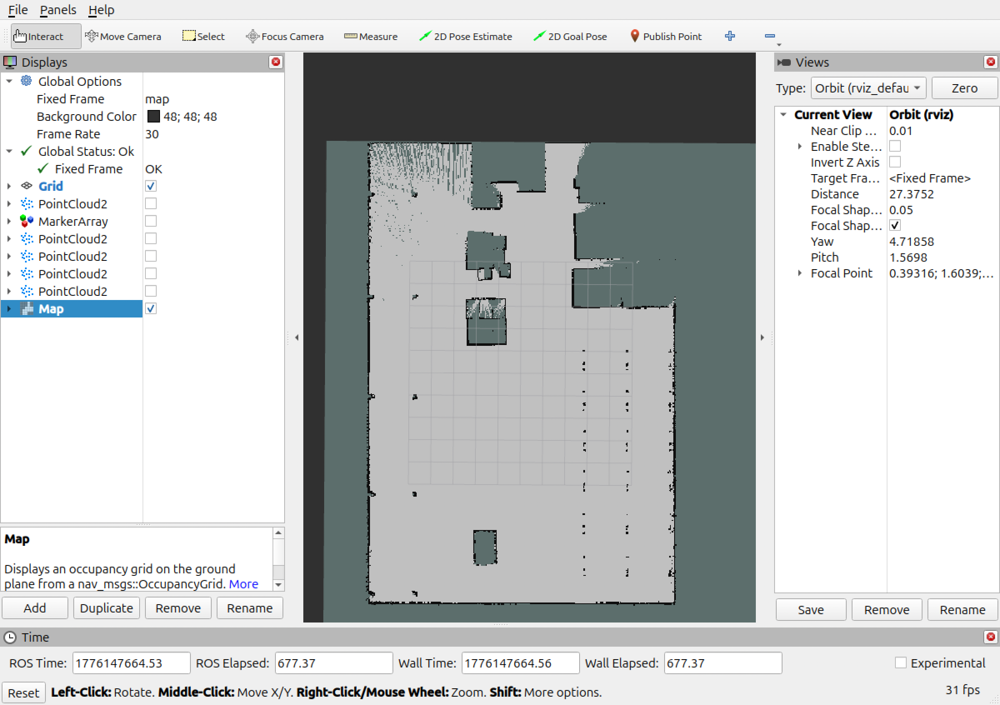
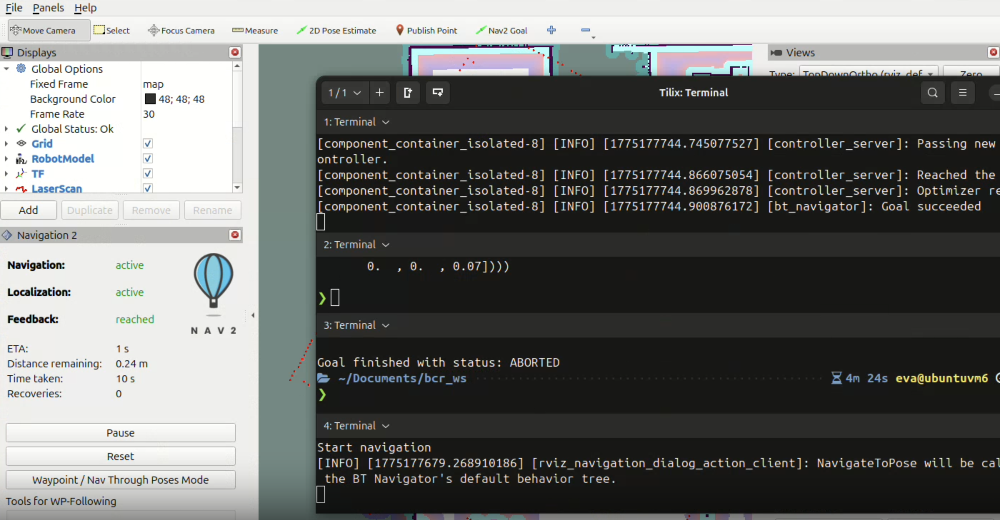
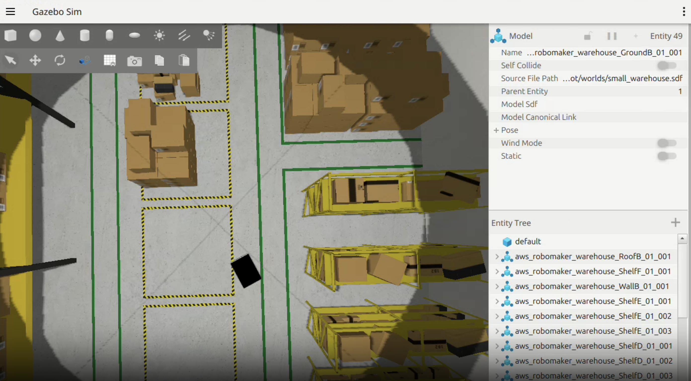
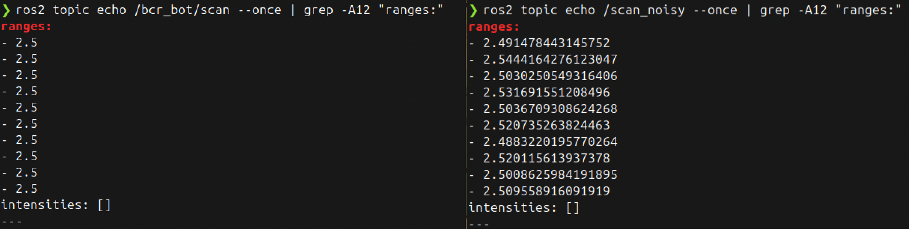
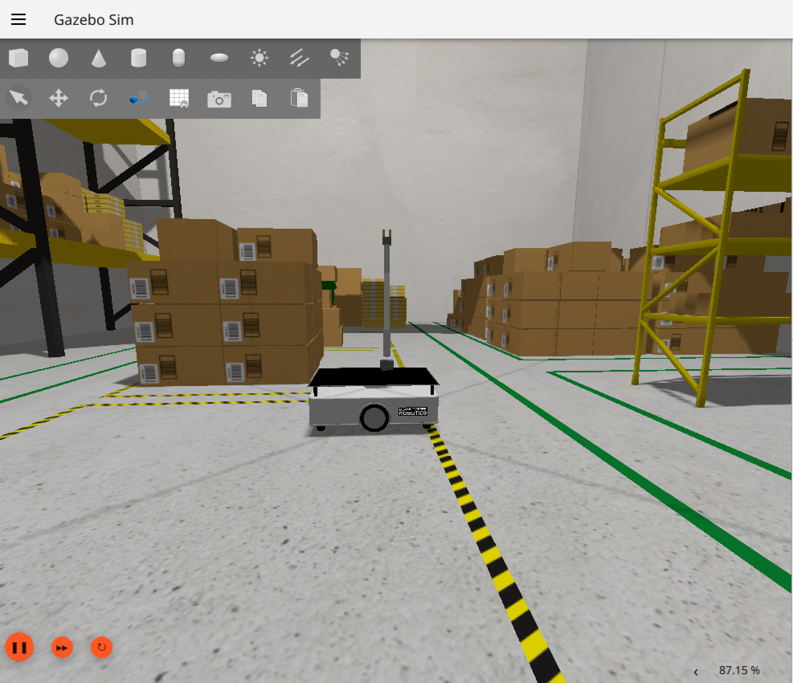
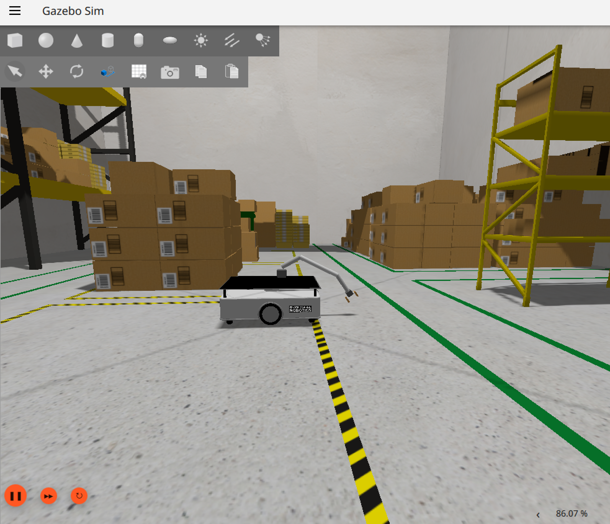
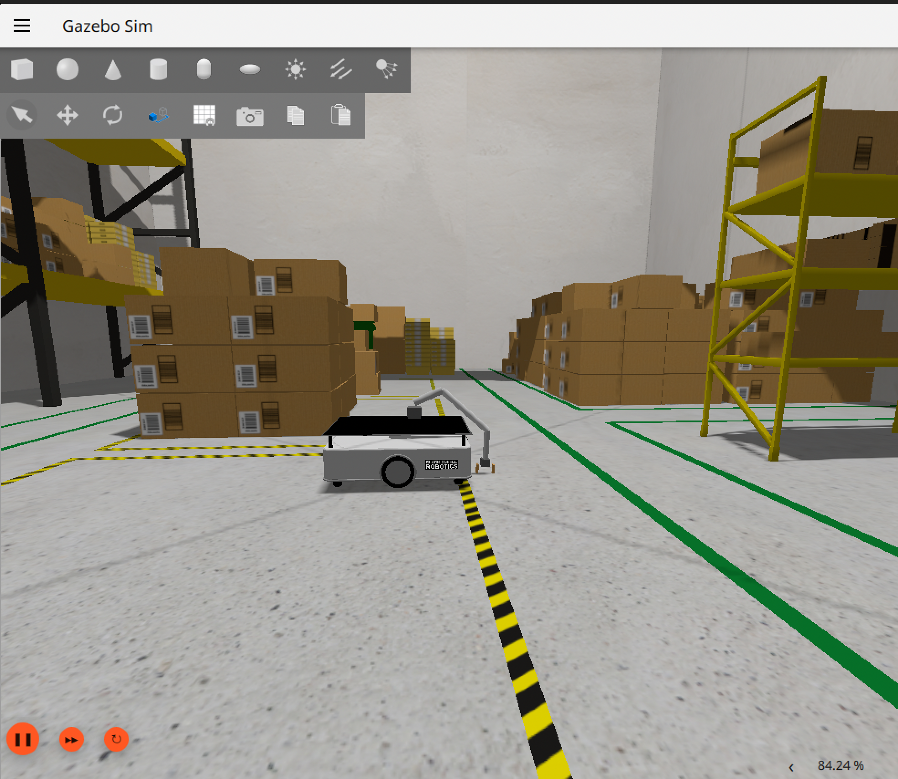
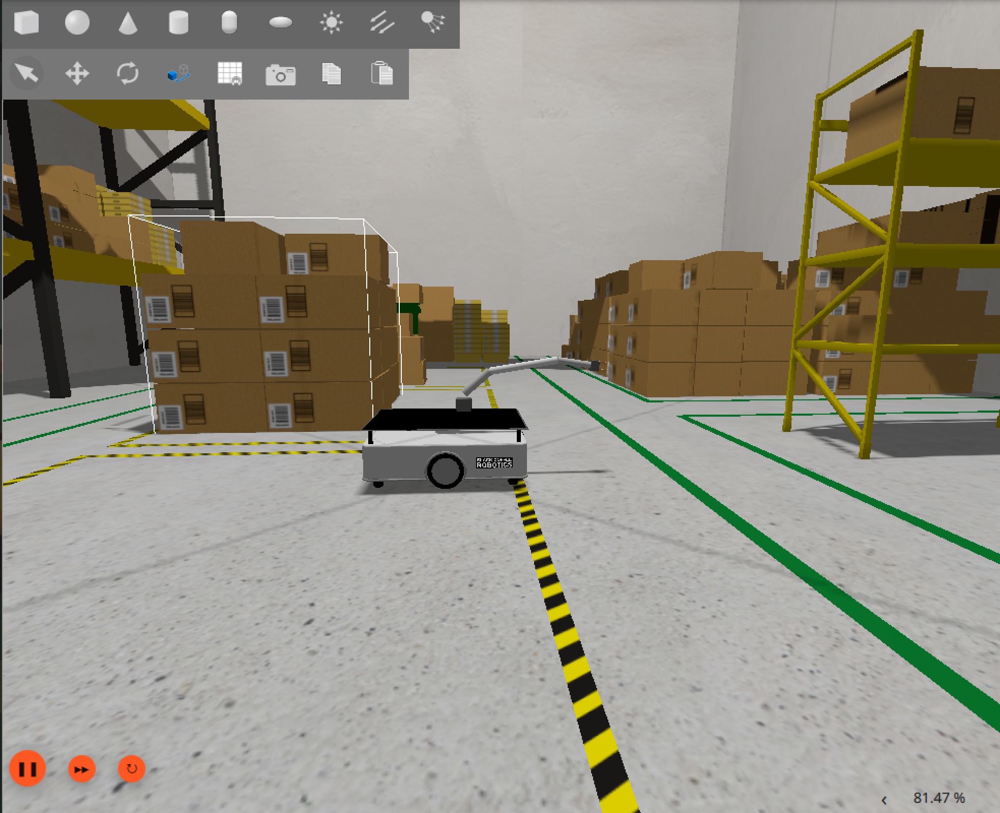
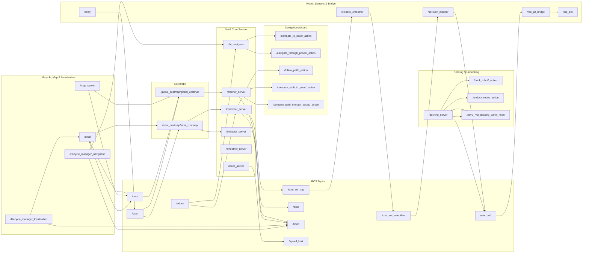
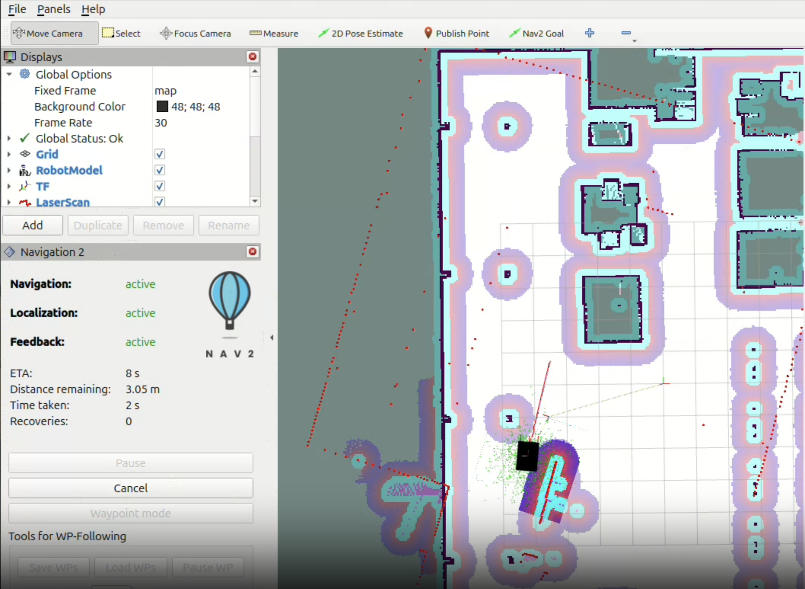

**Team:** Point Cloud Nine · RAS 598 · ASU · Spring 2026

> Milestone 2 delivers autonomous navigation in a pre-mapped warehouse environment using Nav2 and SLAM Toolbox, a verified noise injection subsystem, a working 3-DOF robotic arm with parallel gripper mounted on bcr_bot, and the foundational arm sequencing and fetch coordination nodes required for the full pick-and-place pipeline in Milestone 3.

---
✅
## On This Page

- [1. Milestone 1 Feedback Integration](#1-milestone-1-feedback-integration)
- [2. System Architecture Update](#2-system-architecture-update)
- [3. Kinematics](#3-kinematics)
- [4. SLAM Mapping](#4-slam-mapping)
- [5. Autonomous Navigation with Nav2](#5-autonomous-navigation-with-nav2)
- [6. Noise Injector: Analysis & Results](#6-noise-injector-analysis--results)
- [7. Arm Integration](#7-arm-integration)
- [8. New Nodes](#8-new-nodes)
- [9. System Node Graph](#9-system-node-graph)
- [10. Run-Time Issues & Solutions](#10-run-time-issues--solutions)
- [11. Milestone Video](#11-milestone-video)
- [12. Individual Contributions](#12-individual-contributions)

---

## 1. Milestone 1 Feedback Integration

| Professor Feedback | Action Taken |
|---|---|
| Robot platform selection needed justification | Added explicit rationale for bcr_bot over TurtleBot4 in M1 Section 5 (no official TB4 + arm URDF exists) |
| Arm choice was underspecified | Replaced OpenMANIPULATOR-X plan with custom 3-DOF arm; documented joint geometry, mount position, and reach calculations |
| Simulation world should be confirmed working | Switched from `depot.sdf` (TurtleBot4-specific) to `small_warehouse.sdf` which ships with bcr_bot and was verified working in Gazebo Harmonic |
| Dependencies needed to be more concrete | Updated M1 Section 6 with actual installed package versions and build decisions |
| Architecture diagram should reflect actual implementation | Updated Mermaid diagram to match actual ROS 2 nodes running in simulation |

---

## 2. System Architecture Update

### What Changed from M1

The core pipeline remains Perception → Estimation → Planning → Actuation, but several implementation choices changed during M2 development:

| Component | M1 Plan | M2 Implementation | Reason |
|---|---|---|---|
| Robot | TurtleBot4 | bcr_bot | No official TB4 + arm URDF |
| Arm | OpenMANIPULATOR-X | Custom 3-DOF xacro | gz_ros2_control ABI mismatch on aarch64 |
| Arm control | ros2_control JTC | Gazebo JointPositionController | Bypasses broken apt package |
| Simulation world | `depot.sdf` | `small_warehouse.sdf` | Ships with bcr_bot |
| Localization | AMCL only | AMCL + static TF publisher | AMCL timing issue on startup |
| Map frame | Published by AMCL | Static transform at map origin | Workaround for transform timeout |

### Current Module Status

| Module | Package | Type | Status |
|---|---|---|---|
| SLAM Toolbox | `slam_toolbox` | Library | ✅ Used for mapping; map saved |
| Nav2 Stack | `nav2_bringup` | Library | ✅ Active — goals accepted and reached |
| AMCL Localization | `nav2_amcl` | Library | ✅ Active with initialpose workaround |
| Noise Injector | `semantic_fetch_robot` | Custom | ✅ Verified — noisy topics publishing |
| Navigate to Goal | `semantic_fetch_robot` | Custom | ✅ Nav2 action client working |
| Arm Controller | `semantic_fetch_robot` | Custom | ✅ All 5 joints responding |
| Fetch Coordinator | `semantic_fetch_robot` | Custom | ✅ Full sequence implemented |
| Combined URDF | `bcr_bot_with_arm` | Custom | ✅ Robot + arm spawning correctly |
| Semantic Map Server | — | Custom | 🔜 M3 |
| Vision Node (YOLOWorld) | — | Custom + Library | 🔜 M3 |

---

## 3. Kinematics

### 3.1 Differential Drive Base Kinematics

The bcr_bot uses a standard differential drive kinematic model with two powered traction wheels (middle left and middle right) and four passive trolley wheels for stability.

**System parameters:**

| Parameter | Symbol | Value |
|---|---|---|
| Wheel separation | $$L$$ | 0.625 m (track width + wheel width − 0.01) |
| Wheel radius | $$r$$ | 0.101 m |

**Forward kinematics** — given right wheel velocity $$v_r$$ and left wheel velocity $$v_l$$:

$$v = \frac{v_r + v_l}{2}$$

$$\omega = \frac{v_r - v_l}{L}$$

**State update** over timestep $$\Delta t$$:

$$x' = x + v \cos(\theta) \cdot \Delta t$$

$$y' = y + v \sin(\theta) \cdot \Delta t$$

$$\theta' = \theta + \omega \cdot \Delta t$$

**Mapping `/cmd_vel` to wheel velocities** — Nav2 publishes `linear.x` and `angular.z` on `/cmd_vel`. The Gazebo diff-drive plugin converts these to individual wheel velocities:

$$v_r = v + \frac{\omega \cdot L}{2}$$

$$v_l = v - \frac{\omega \cdot L}{2}$$

The bcr_bot's maximum commanded speed is 1.0 m/s linear and 4.18 rad/s angular (as tested during Nav2 teleoperation). Nav2's MPPI controller operates well within these limits, typically commanding 0.3–0.5 m/s linear during autonomous navigation.

### 3.2 3-DOF Arm Kinematics

The custom arm uses a serial chain of three revolute joints all rotating about the Y axis (pitch). This design choice, all joints sharing the same axis, simplifies inverse kinematics to a planar 2D reach problem.

**Joint parameters:**

| Joint | Axis | Link Length After Joint | Range |
|---|---|---|---|
| `arm_joint1` | Y | 0.200 m (`l1_len`) | ±90° |
| `arm_joint2` | Y | 0.410 m (`l3_len`) | ±90° |
| `arm_joint3` | Y | 0.200 m (forearm + TCP) | ±90° |

**Forward kinematics** — end-effector position in the arm base frame given joint angles $\theta_1, \theta_2, \theta_3$:

$$x_{tcp} = l_1 \sin(\theta_1) + l_2 \sin(\theta_1 + \theta_2) + l_3 \sin(\theta_1 + \theta_2 + \theta_3)$$

$$z_{tcp} = l_1 \cos(\theta_1) + l_2 \cos(\theta_1 + \theta_2) + l_3 \cos(\theta_1 + \theta_2 + \theta_3)$$

**Maximum reach** (all joints fully extended): $0.200 + 0.410 + 0.200 = 0.810 \text{ m}$. With the arm mounted at $$(x=0.10, z=0.18 \text{ m})$$ above `base_link`, and `base_link` at 0.295 m above the floor, the arm base is approximately 0.475 m above the ground — giving a working floor-to-arm-base distance well within reach.

**Hardcoded grasp poses** (measured from Gazebo joint states):

| Pose | joint1 | joint2 | joint3 | Gripper |
|---|---|---|---|---|
| Home | 0.000 | 0.000 | 0.000 | Closed |
| Pregrasp | 1.043 | 0.934 | 0.495 | Open (35 mm) |
| Grasp | 1.156 | 1.163 | 0.913 | Open → Close |
| Carry | 0.827 | 0.527 | 0.299 | Closed |

### 3.3 Gripper Kinematics

The parallel gripper uses two prismatic joints (`left_finger_joint`, `right_finger_joint`) each with 35 mm stroke. Both fingers move symmetrically along the X axis. Closing the gripper commands both joints to 0.0 m; opening commands both to 0.035 m. Finger friction coefficient $\mu = 1.5$ in Gazebo to simulate grip on small objects.

---

## 4. SLAM Mapping

### Mapping Process

The warehouse map was built by teleoperating bcr_bot through the `small_warehouse.sdf` environment using SLAM Toolbox in online async mapping mode. Key configuration changes from default:

| Parameter | Default | Our Value | Reason |
|---|---|---|---|
| `scan_topic` | `/scan` | `/bcr_bot/scan` | bcr_bot publishes on namespaced topic |
| `base_frame` | `base_link` | `base_footprint` | bcr_bot TF tree uses base_footprint |
| `transform_timeout` | 0.2 s | 2.0 s | VM timing — extra buffer for TF lookups |
| `mode` | `mapping` | `mapping` | Disabled localization mode for initial map build |

A scan relay node (`topic_tools relay /bcr_bot/scan /scan`) was required because Nav2's costmaps subscribe to `/scan` by default. This was resolved in the custom Nav2 params file by setting `scan_topic: /bcr_bot/scan` directly.

### Map Saved



The saved map covers the full warehouse environment:

| Property | Value |
|---|---|
| Resolution | 0.05 m/cell |
| Size | 523 × 517 cells (26.15 m × 25.85 m) |
| Origin | [−16.344, −14.035, 0] |
| Free threshold | 0.196 |
| Occupied threshold | 0.650 |
| Files | `maps/warehouse_map.pgm`, `maps/warehouse_map.yaml` |

Map was saved using:

```bash
ros2 run nav2_map_server map_saver_cli \
  -f ~/Documents/bcr_ws/maps/warehouse_map
```

---

## 5. Autonomous Navigation with Nav2

### Launch Configuration

Navigation is launched with the full `bringup_launch.py` stack, which includes the map server, AMCL, planner server, controller server, behavior server, and bt_navigator. Key customizations in `nav2_params.yaml`:

| Parameter | Change | Effect |
|---|---|---|
| `robot_base_frame` | `base_link` → `base_footprint` | Matches bcr_bot TF tree |
| `scan_topic` | `scan` → `/bcr_bot/scan` | Routes LiDAR from namespaced topic |

### Map→Odom Transform Workaround

AMCL requires an initial pose estimate before it publishes the `map→odom` transform. Without this transform, Nav2's costmaps cannot activate. During development, AMCL's scan timestamps were offset from the TF cache causing repeated transform timeout failures.

**Workaround:** A `static_transform_publisher` node publishes the `map→odom` transform at the map origin `(−16.344, −14.035, 0)` until AMCL establishes localization. The initial pose is then set via:

```bash
ros2 topic pub --once /initialpose \
  geometry_msgs/msg/PoseWithCovarianceStamped \
  '{header: {frame_id: "map"}, pose: {pose: {position: {x: -16.0, y: -13.5}}, ...}}'
```

Once AMCL sets the pose, it takes over the transform and localization continues normally.

### Navigation Results





A navigation goal was sent via the Nav2 action server and the robot successfully reached the target:

```
Goal accepted with ID: 19b190cf401b43cd81f3a2e79e995b96
Feedback: reached
Distance remaining: 0.03 m
Time taken: 24 s
Recoveries: 0
Goal succeeded
```

Goals were also sent programmatically via `navigate_to_goal.py` using the `NavigateToPose` action:

```python
ros2 action send_goal /navigate_to_pose nav2_msgs/action/NavigateToPose \
  "{pose: {header: {frame_id: 'map'}, pose: {position: {x: -10.0, y: -8.0}}}}"
```

---

## 6. Noise Injector: Analysis & Results

### How It Works

The `noise_injector_node` subscribes to `/bcr_bot/scan` (LiDAR) and `/bcr_bot/odom` (odometry) and republishes noise-corrupted versions on `/scan_noisy` and `/odom_noisy`. Gaussian noise is added independently to each LiDAR range measurement and each odometry position component.

```python
# LiDAR noise injection
ranges = np.array(msg.ranges)
noise = np.random.normal(0, self.lidar_std, ranges.shape)
noisy.ranges = (ranges + noise).tolist()

# Odometry noise injection
noisy.pose.pose.position.x += np.random.normal(0, self.odom_std)
noisy.pose.pose.position.y += np.random.normal(0, self.odom_std)
```

**Noise parameters:**

| Parameter | Value | Physical Meaning |
|---|---|---|
| `lidar_noise_std` | 0.02 m | ±20 mm range uncertainty — typical for consumer LiDAR |
| `odom_noise_std` | 0.005 m | ±5 mm position drift per step — typical wheel slip |

These values were chosen to approximate the sensor characteristics of the RPLIDAR A1 and typical differential drive odometry reported in literature.

### Before vs. After Comparison



Sample comparison (5 range values, same timestamp):

| Index | Clean `/bcr_bot/scan` | Noisy `/scan_noisy` | Difference |
|---|---|---|---|
| 0 | 2.4410 m | 2.4287 m | −0.0123 m |
| 1 | 2.4401 m | 2.4614 m | +0.0213 m |
| 2 | 2.4394 m | 2.4178 m | −0.0216 m |
| 3 | 2.4389 m | 2.4502 m | +0.0113 m |
| 4 | 2.4381 m | 2.4595 m | +0.0214 m |

The noise injector publishes at the same frequency as the input topics (30 Hz for LiDAR, 10 Hz for odometry), confirmed by:

```bash
ros2 topic hz /scan_noisy
# average rate: 30.0 Hz
```

---

## 7. Arm Integration

### Combined URDF

The `bcr_bot_with_arm.urdf.xacro` file in the `bcr_bot_with_arm` package composes the full robot. The arm is attached to the chassis via a fixed `arm_mount_joint` at position `(x=0.10, z=0.18 m)` from `base_link`.



### Arm Moving to Pregrasp



### Arm Reaching Ground (Grasp Position)



### Carry Position



### Joint Control

Each arm joint is controlled by a separate `gz-sim-joint-position-controller-system` plugin, receiving Float64 position commands via ROS-GZ bridge:

```bash
# Example: move shoulder joint to -0.8 rad
ros2 topic pub --once /arm_joint2_cmd std_msgs/msg/Float64 "{data: -0.8}"
```

The bridge translates ROS `std_msgs/msg/Float64` → Gazebo `gz.msgs.Double` for each joint topic.

---

## 8. New Nodes

### `navigate_to_goal.py`

A Nav2 action client that sends `NavigateToPose` goals to the robot. Accepts x, y coordinates, monitors goal progress, and logs success or failure.

| Detail | Value |
|---|---|
| Action client | `/navigate_to_pose` → `nav2_msgs/action/NavigateToPose` |
| Dependencies | `rclpy`, `nav2_msgs`, `geometry_msgs`, `action_msgs` |
| Entry point | `navigate_to_goal = semantic_fetch_robot.navigate_to_goal:main` |

### `arm_controller.py`

Manages the 3-DOF arm and gripper through a library of hardcoded poses. Resends commands 10 times at 0.4 s intervals to overcome Gazebo physics step latency.

**Poses:**

| Pose | joint1 | joint2 | joint3 | Gripper |
|---|---|---|---|---|
| `home` | 0.000 | 0.000 | 0.000 | closed |
| `pregrasp` | 1.043 | 0.934 | 0.495 | open |
| `grasp` | 1.156 | 1.163 | 0.913 | open → close |
| `grasp_close` | 1.156 | 1.163 | 0.913 | closed |
| `carry` | 0.827 | 0.527 | 0.299 | closed |

| Detail | Value |
|---|---|
| Publishers | `/arm_joint1_cmd`, `/arm_joint2_cmd`, `/arm_joint3_cmd`, `/left_finger_cmd`, `/right_finger_cmd` (Float64) |
| Dependencies | `rclpy`, `std_msgs` |
| Entry point | `arm_controller = semantic_fetch_robot.arm_controller:main` |

### `fetch_coordinator.py`

Sequences the full fetch mission: home arm → navigate to object → grasp → navigate home → deliver. Uses `ArmController` for arm control and the `NavigateToPose` action for navigation.

**State machine:**

```
IDLE → NAV_TO_OBJECT → GRASP → NAV_HOME → DELIVER → IDLE
```

| Detail | Value |
|---|---|
| Action client | `/navigate_to_pose` |
| Uses | `ArmController` class from `arm_controller.py` |
| Entry point | `fetch_coordinator = semantic_fetch_robot.fetch_coordinator:main` |

---

## 9. System Node Graph



The rqt_graph dot file is saved in the repository. Key connections visible in the graph:

- `/ros_gz_bridge` → `/bcr_bot/scan` → `/relay` → `/scan` → `/local_costmap`, `/global_costmap`, `/collision_monitor`
- `/map_server` → `/map` → `/global_costmap`, `/amcl`
- `/amcl` → `/initialpose` → TF `map→odom`
- `/bt_navigator` → `/navigate_to_pose` action → `/planner_server` → `/controller_server` → `/cmd_vel` → `/ros_gz_bridge`
- `/noise_injector_node` → `/scan_noisy`, `/odom_noisy`

---

## 10. Run-Time Issues & Solutions

### Issue 1: `two_d_lidar` TF Frame Mismatch

**Problem:** SLAM Toolbox reported `discarding message because the queue is full` for frame `base_link`. The bcr_bot's LiDAR sensor published with `gz_frame_id` set to `two_d_lidar` but the URDF used `base_link` as the scan reference frame, causing a TF lookup failure.

**Solution:** Changed `<gz_frame_id>two_d_lidar</gz_frame_id>` to `<gz_frame_id>base_link</gz_frame_id>` in `gz.xacro`. This aligns the Gazebo sensor frame with the URDF TF frame and resolved all queue-full warnings.

### Issue 2: AMCL Transform Timeout Blocking Nav2 Activation

**Problem:** Nav2's global costmap timed out waiting for `base_link → map` transform before AMCL had time to initialize. The costmap printed repeated `Timed out waiting for transform` errors and Nav2 failed to activate.

**Solution:** Published a `static_transform_publisher` for `map→odom` at the known map origin offset `(−16.344, −14.035, 0)`. This gives Nav2 an immediate valid transform on startup. The initial pose is then set via `/initialpose` topic to activate AMCL's particle filter. AMCL takes over the transform after receiving its first valid scan.

### Issue 3: Map Coordinate Offset

**Problem:** The robot spawns at Gazebo world coordinates `(0, 0)` but the saved SLAM map has origin `(−16.344, −14.035)`. This means the robot's Gazebo position and its map-frame position differ by this offset. Navigation goals in map coordinates must account for this.

**Solution:** All navigation goals in `fetch_coordinator.py` use map-frame coordinates (e.g., `x=-10.0, y=-8.0`) rather than Gazebo world coordinates. The static transform publisher bridges the two coordinate systems.

### Issue 4: gz_ros2_control ABI Mismatch on aarch64

**Problem:** The apt-installed `ros-jazzy-gz-ros2-control` package failed with `undefined symbol: _ZTIN18hardware_interface26HardwareComponentInterfaceE` on aarch64 Ubuntu 24.04. This prevented any ros2_control-based arm controller from loading.

**Solution:** Built `gz_ros2_control` from source (`-b jazzy` branch of `ros-controls/gz_ros2_control`) in the local workspace. The source build compiles against the exact installed `hardware_interface` version. As an additional measure, the arm control architecture was redesigned to use Gazebo's native `gz-sim-joint-position-controller-system` plugin instead of ros2_control entirely, eliminating the dependency.

### Issue 5: Arm Joint Not Responding to Single Commands

**Problem:** Publishing a single `/arm_joint*_cmd` message often had no effect. The Gazebo physics step did not always process a single latched message reliably.

**Solution:** The `arm_controller.py` `move_to_pose()` method resends each command 10 times at 0.4 s intervals before waiting for the settle time. This ensures the command is received and processed regardless of Gazebo physics step timing.

---

## 11. Milestone Video

> **Video link:** [Milestone 2 Video](https://youtu.be/e9of-E6w7vQ?si=fUY4H4K9nSs2m2uN)

The milestone video demonstrates:

1. Gazebo Harmonic simulation launching with bcr_bot + arm in the small warehouse world
2. RViz showing the pre-built occupancy map, LiDAR scan overlay, and Nav2 costmap
3. Navigation goal sent — robot plans a path and drives autonomously to the goal
4. Nav2 panel showing "Navigation: active", distance remaining decreasing, "Feedback: reached"
5. Noise injector running — `/scan_noisy` topic visible in a terminal
6. Arm moving through home → pregrasp → grasp → carry sequence



---

## 12. Individual Contributions

| Team Member | Role | Key Contributions | Files / Commits |
|---|---|---|---|
| Divyaraj (Person 1) | Navigation & Simulation Lead | SLAM mapping setup and debugging · Nav2 bringup and param tuning · TF frame issue diagnosis and fix · Combined robot URDF composition · Arm joint controller setup · Launch file development · rqt_graph capture · Milestone video recording | `maps/warehouse_map.*` · `bcr_bot_with_arm.urdf.xacro` · `bcr_bot_with_arm.launch.py` · |
| Suyash (Person 2) | Nodes & Architecture Lead | `noise_injector_node.py` testing and data collection · `navigate_to_goal.py` implementation · `arm_controller.py` pose calibration · `fetch_coordinator.py` mission sequencer · `setup.py` entry points · `package.xml` dependency updates | `semantic_fetch_robot/noise_injector_node.py` · `semantic_fetch_robot/navigate_to_goal.py` · `semantic_fetch_robot/arm_controller.py` · `semantic_fetch_robot/fetch_coordinator.py` ·

---

## Running Milestone 2

### Prerequisites

```bash
# Build bcr_bot_with_arm package
cd ~/Documents/bcr_ws
colcon build --packages-select bcr_bot_with_arm gz_ros2_control \
  --allow-overriding gz_ros2_control --symlink-install
source install/setup.bash

# Build semantic_fetch_robot package
cd ~/Documents/semantic_fetch_robot
colcon build --symlink-install
source install/setup.bash
```

### Launch Simulation with Arm

```bash
ros2 launch bcr_bot_with_arm bcr_bot_with_arm.launch.py
```

Press ▶ Play in Gazebo. Wait 10 seconds.

### Launch Nav2

```bash
ros2 launch nav2_bringup bringup_launch.py \
  use_sim_time:=true \
  map:=/home/eva/Documents/bcr_ws/maps/warehouse_map.yaml \
  params_file:=/home/eva/Documents/bcr_ws/nav2_params.yaml
```

### Set Initial Pose

```bash
ros2 topic pub --once /initialpose \
  geometry_msgs/msg/PoseWithCovarianceStamped \
  '{header: {frame_id: "map"}, pose: {pose: {position: {x: -16.0, y: -13.5, z: 0.0}, orientation: {w: 1.0}}, covariance: [0.25,0,0,0,0,0,0,0.25,0,0,0,0,0,0,0,0,0,0,0,0,0,0,0,0,0,0,0,0,0,0,0,0,0,0,0,0.07]}}'
```

### Run Noise Injector

```bash
ros2 run semantic_fetch_robot noise_injector_node
```

### Test Navigation

```bash
ros2 run semantic_fetch_robot navigate_to_goal
```

### Test Arm Sequence

```bash
ros2 run semantic_fetch_robot arm_controller
```

### Run Full Fetch Mission

```bash
ros2 run semantic_fetch_robot fetch_coordinator
```

---

*Next → [Milestone 3 — Object spawning + full pick-and-place pipeline](#)*

---

**Semantic Fetch Robot** · RAS 598 Mobile Robotics · Team: Point Cloud Nine · Arizona State University · 2026
