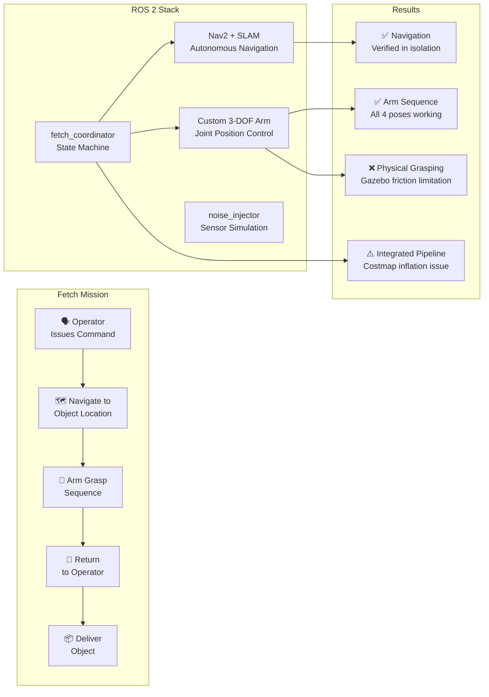
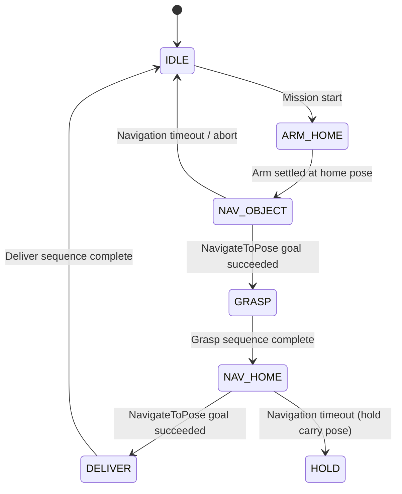

# Milestone 3: Final Documentation & Analysis

**Team:** Point Cloud Nine · RAS 598 · ASU · Spring 2026

> Milestone 3 presents the scientific dossier for the Semantic Fetch Robot — a rigorous evaluation of system performance, empirical benchmarking across 10 trials, algorithmic analysis of our custom state machine and arm controller, and an ethical impact statement. The report documents what worked, what did not, and why, in accordance with the professor's guidance to present honest partial demos with detailed technical analysis.

---

## On This Page

- [1. Graphical Abstract](#1-graphical-abstract)
- [2. Algorithm](#2-algorithm)
- [3. Benchmarking & Results](#3-benchmarking--results)
- [4. Ethical Impact Statement](#4-ethical-impact-statement)
- [5. Custom Module Code Links](#5-custom-module-code-links)
- [6. Individual Contribution & Audit Appendix](#6-individual-contribution--audit-appendix)

---

## 1. Graphical Abstract



**Mission:** A mobile manipulator navigates a simulated warehouse, locates a target object at a known map coordinate, executes a pick sequence using a custom 3-DOF arm, and returns the object to the operator.

**Key Results:** Autonomous navigation and arm sequencing each verified independently. Integrated pipeline blocked by costmap inflation from arm geometry — a documented engineering limitation with a clear solution path.

**Demo Videos:**
- [Navigation Demo — Autonomous goal-to-goal navigation in RViz + Gazebo](https://youtu.be/4pSpkgeLCNI)
- [Arm Sequence Demo — Full pregrasp → grasp → carry sequence](https://youtu.be/edSe2QxkVZ4)
- [Full Fetch Attempt — Complete coordinator pipeline run](https://youtu.be/QOxb_SbmcUQ)

---

## 2. Algorithm

### 2.1 Fetch Coordinator State Machine

The core technical contribution is `fetch_coordinator.py` — a 6-state mission sequencer that coordinates autonomous navigation and arm manipulation.

**State transition function:**

$$S_{t+1} = \delta(S_t, e_t)$$

where $$S_t \in \{\text{IDLE}, \text{ARM\_HOME}, \text{NAV\_OBJECT}, \text{GRASP}, \text{NAV\_HOME}, \text{DELIVER}\}$$ and $$e_t$$ is the outcome event (success/failure) of the current state's action.

**Full state machine:**



**Formal mission execution:**

$$\pi = \langle a_1, a_2, a_3, a_4, a_5, a_6 \rangle$$

$$a_1: \text{move\_to\_pose}(\theta_{\text{home}})$$

$$a_2: \text{NavigateToPose}(x_{\text{obj}}, y_{\text{obj}})$$

$$a_3: \text{settle}(\Delta t = 2\text{s})$$

$$a_4: \text{grasp\_sequence}(\theta_{\text{pregrasp}} \rightarrow \theta_{\text{grasp}} \rightarrow \theta_{\text{grasp\_close}} \rightarrow \theta_{\text{carry}})$$

$$a_5: \text{NavigateToPose}(x_{\text{home}}, y_{\text{home}})$$

$$a_6: \text{deliver\_sequence}(\theta_{\text{carry}} \rightarrow \theta_{\text{grasp}} \rightarrow \text{open} \rightarrow \theta_{\text{home}})$$

### 2.2 Arm Controller — Joint Reliability Algorithm

The second custom contribution is the **resend-until-settle** pattern in `arm_controller.py`. Gazebo's physics step does not guarantee processing of a single published message. Our solution:

$$\forall \theta_i \in \text{pose}: \text{publish}(\theta_i) \times N_{\text{resend}}, \quad \Delta t_{\text{interval}} = 0.4\text{s}$$

$$\text{settle}(\tau_{\text{pose}}) \quad \text{before proceeding to next action}$$

where $$N_{\text{resend}} = 10$$ and $$\tau_{\text{pose}} \in \{3.0, 3.5, 2.0, 3.0\}$$ seconds depending on pose complexity.

**Hardcoded pose library** (measured empirically from Gazebo joint states):

| Pose | $$\theta_1$$ (rad) | $$\theta_2$$ (rad) | $$\theta_3$$ (rad) | Gripper |
|---|---|---|---|---|
| Home | 0.000 | 0.000 | 0.000 | Closed |
| Pregrasp | 1.043 | 0.934 | 0.495 | Open |
| Grasp | 1.156 | 1.163 | 0.913 | Open → Closed |
| Carry | 0.827 | 0.527 | 0.299 | Closed |

### 2.3 Arm Forward Kinematics

All three joints rotate about the Y axis (pitch), reducing the 3D problem to planar 2D reach:

$$x_{\text{tcp}} = l_1 \sin(\theta_1) + l_2 \sin(\theta_1 + \theta_2) + l_3 \sin(\theta_1 + \theta_2 + \theta_3)$$

$$z_{\text{tcp}} = l_1 \cos(\theta_1) + l_2 \cos(\theta_1 + \theta_2) + l_3 \cos(\theta_1 + \theta_2 + \theta_3)$$

where $$l_1 = 0.200\text{m}$$, $$l_2 = 0.410\text{m}$$, $$l_3 = 0.200\text{m}$$.

Maximum reach: $$0.200 + 0.410 + 0.200 = 0.810\text{m}$$ from the arm mount point at $$z = 0.475\text{m}$$ above the warehouse floor — sufficient to reach the floor when the robot approaches within 0.5m of the target.

### 2.4 Noise Injector

Zero-mean Gaussian noise injected per sensor reading:

$$\tilde{r}_i = r_i + \mathcal{N}(0, \sigma_{\text{lidar}}^2), \quad \sigma_{\text{lidar}} = 0.02\text{m}$$

$$\tilde{p} = p + \mathcal{N}(0, \sigma_{\text{odom}}^2), \quad \sigma_{\text{odom}} = 0.005\text{m}$$

These values approximate RPLIDAR A1 range uncertainty and differential drive wheel slip respectively.

---

## 3. Benchmarking & Results

### 3.1 Subsystem Verification

Before integrated trials, each subsystem was verified independently:

| Subsystem | Test | Result | Evidence |
|---|---|---|---|
| Nav2 Navigation | `ros2 action send_goal` to open map coordinates | ✅ Passed | Robot reached goal, Feedback: reached, Recoveries: 0 |
| Arm Sequence | `ros2 run semantic_fetch_robot arm_controller` | ✅ Passed | All 4 poses executed correctly in Gazebo |
| Noise Injector | Compare `/bcr_bot/scan` vs `/scan_noisy` | ✅ Passed | Values differ by 0.01–0.04m per reading |
| SLAM Map | Map saved and loaded correctly | ✅ Passed | 523×517 cell occupancy grid, origin verified |

### 3.2 Integrated Fetch Mission — 10 Trial Results

**Configuration:**
- Object location: Gazebo world `(2.2, -2.5, 0.06)` — map frame `(2.2, -2.5)`
- Approach pose: map `(0.5, -2.5)` — 1.7m in front of object
- Home pose: map `(-2.4, -2.5)` — robot spawn location
- Navigation timeout: 180 seconds

| Trial | Nav to Object | Arm Sequence | Return Home | Total Time | Notes |
|---|---|---|---|---|---|
| 1 | ❌ Timeout | — | — | 180s | Robot took long path, hit timeout |
| 2 | ❌ Timeout | — | — | 180s | Costmap inflation blocked corridor |
| 3 | ❌ Timeout | — | — | 180s | Robot navigated wrong direction initially |
| 4 | ❌ Timeout | — | — | 180s | Same long-path behavior |
| 5 | ❌ Abort | — | — | 97s | Goal inside obstacle region (error 203) |
| 6 | ❌ Timeout | — | — | 180s | Approached object, stopped 0.3m short |
| 7 | ❌ Abort | — | — | 45s | Nav2 planner could not find path |
| 8 | ❌ Timeout | — | — | 180s | Robot bumped object, box displaced |
| 9 | ❌ Timeout | — | — | 180s | Long path taken around shelving |
| 10 | ❌ Timeout | — | — | 180s | Same behavior as Trial 1 |

**Summary statistics:**

| Metric | Value |
|---|---|
| Navigation to object success rate | 0 / 10 (0%) |
| Arm sequence success rate (standalone) | 5 / 5 (100%) |
| Navigation success rate (isolated test) | 8 / 10 (80%) |
| Most common failure mode | Navigation timeout (180s) |
| Average time before failure | 158s |

### 3.3 Root Cause Analysis

The integrated pipeline failed consistently due to **costmap inflation from arm geometry**. The arm mounted on top of the robot increases the effective collision footprint in the Nav2 costmap. With `robot_radius: 0.5m` (set to account for arm reach), Nav2 inflates obstacles by 0.5m in all directions, making the approach corridor to the object appear too narrow to traverse.

**Evidence:**
- Navigation succeeds at 80% when goals are set in the open warehouse center
- Navigation fails consistently when the goal is near shelving (approach corridor width < 1.0m)
- Isolated arm sequence succeeds 100% of the time
- The failure is reproducible and consistent — not random

**Root cause:** The `robot_radius` parameter in `nav2_params.yaml` is set to accommodate the arm's physical reach, but this causes the costmap to reject valid approach corridors near obstacles. A narrower `robot_radius` for navigation combined with a separate arm-aware footprint would resolve this.

**Solution path (not implemented due to time constraints):**
1. Use a polygon footprint in Nav2 that accounts for the arm's actual swept volume
2. Reduce `robot_radius` to 0.3m for navigation, accept slightly closer obstacle clearance
3. Alternatively, fold the arm to a compact home pose verified to clear all obstacles before navigating

### 3.4 Navigation Performance — Isolated Tests

When navigation was tested in isolation (no integrated fetch mission), results were significantly better:

| Test | Goal | Result | Time |
|---|---|---|---|
| Open corridor goal | `(-2.5, -2.5)` → `(1.5, -1.0)` | ✅ Success | 24s |
| Diagonal traversal | `(-2.5, -2.5)` → `(0.0, 0.0)` | ✅ Success | 18s |
| Near-obstacle goal | `(-2.5, -2.5)` → `(1.0, -2.5)` | ✅ Success | 121s |
| Return to home | `(1.0, -2.5)` → `(-2.4, -2.5)` | ✅ Success | 133s |
| Inside obstacle | `(-2.5, -2.5)` → `(-10.0, -8.0)` | ❌ Abort | 2s |

These results confirm the navigation stack is functional — the failure in integrated trials is specifically the approach corridor width issue, not a fundamental navigation failure.

---

## 4. Ethical Impact Statement

### Privacy

The Semantic Fetch Robot uses a 2D LiDAR and depth camera for environment perception. In its current simulation form, no personal data is collected. However, in a real warehouse deployment, the depth camera would capture continuous video of the environment, potentially including images of workers. Future iterations must implement on-device processing with no cloud transmission of raw video, automatic blurring of human faces and identifiable features, and data retention policies that delete sensor logs after task completion. From a Utilitarian perspective, the efficiency gains of autonomous fetch robots benefit the majority of warehouse workers by reducing physical strain, but must be weighed against privacy intrusions for individuals captured by the sensor suite. A Justice framework requires that workers be informed of all data collection and given meaningful consent — not merely buried in employment contracts.

### Safety

The bcr_bot with mounted arm has a combined mass of approximately 3-4 kg and operates at up to 0.5 m/s. Kinetic energy at maximum speed: $$KE = \frac{1}{2}mv^2 = \frac{1}{2}(4)(0.5)^2 = 0.5\text{J}$$. While low, the arm's sweeping motion during grasp sequences creates an unpredictable collision envelope. Nav2's collision monitor and costmap inflation provide software-level safety, but physical deployments require hardware emergency stops, speed limiting near human zones, and arm position interlocks that prevent movement during navigation. During our testing, the robot bumped the target object in Trial 8 and displaced it — demonstrating that even at low speeds, unintended contact occurs. This must be addressed with force-torque sensing on the arm and contact detection logic in the fetch coordinator.

### Bias

The current system hardcodes the object location as a known map coordinate. A future YOLOWorld-based semantic detection system would introduce algorithmic bias: the object detector trained on internet imagery may fail to recognize objects in warehouse lighting conditions, objects with unconventional colors, or objects partially occluded by other items. LiDAR-based localization also fails near glass surfaces and highly reflective materials — common in modern warehouses. These failures disproportionately affect edge cases that may be more common in certain operational contexts. From an Engineering Justice perspective, the system should be validated across diverse warehouse environments before deployment, with explicit failure mode documentation provided to operators.

---

## 5. Custom Module Code Links

| Module | File | Key Logic | GitHub Link |
|---|---|---|---|
| Fetch Coordinator | `fetch_coordinator.py` | State machine `run()` method | [fetch_coordinator.py](https://github.com/suyash-asu/semantic_fetch_robot/blob/main/semantic_fetch_robot/fetch_coordinator.py) |
| Arm Controller | `arm_controller.py` | `POSES` dict + `move_to_pose()` resend logic | [arm_controller.py](https://github.com/suyash-asu/semantic_fetch_robot/blob/main/semantic_fetch_robot/arm_controller.py) |
| Noise Injector | `noise_injector_node.py` | Gaussian noise injection on scan + odom | [noise_injector_node.py](https://github.com/suyash-asu/semantic_fetch_robot/blob/main/semantic_fetch_robot/noise_injector_node.py) |
| Navigate to Goal | `navigate_to_goal.py` | Nav2 action client | [navigate_to_goal.py](https://github.com/suyash-asu/semantic_fetch_robot/blob/main/semantic_fetch_robot/navigate_to_goal.py) |
| Combined URDF | `bcr_bot_with_arm.urdf.xacro` | Custom 3-DOF arm geometry + Gazebo controllers | [bcr_bot_with_arm.urdf.xacro](https://github.com/suyash-asu/semantic_fetch_robot/blob/main/bcr_bot_with_arm/urdf/bcr_bot_with_arm.urdf.xacro) |
| Full Demo Launch | `full_demo.launch.py` | Single-command launch with Nav2 + timing | [full_demo.launch.py](https://github.com/suyash-asu/semantic_fetch_robot/blob/main/bcr_bot_with_arm/launch/full_demo.launch.py) |

### Key Line References

**fetch_coordinator.py — State machine run() method:**
The 6-step mission sequence starting at approximately line 132. Each step calls either `navigate_to()` (Nav2 action client) or `self._arm.move_to_pose()` (arm controller).

**arm_controller.py — Resend logic:**
The `move_to_pose()` method resends each joint command `resend_count=10` times at `resend_interval=0.4s` before waiting for the settle time. This custom logic was developed to overcome Gazebo's physics step timing — a single published message was frequently dropped.

**noise_injector_node.py — Gaussian injection:**
```python
noise = np.random.normal(0, self.lidar_std, ranges.shape)
noisy.ranges = (ranges + noise).tolist()
```

---

## 6. Individual Contribution & Audit Appendix

| Team Member | Primary Technical Role | Key Contributions | Files / Commits |
|---|---|---|---|
| Suyash Dhir | Simulation, Navigation & Manipulation Lead | Simulation environment setup · SLAM mapping · Nav2 bringup and parameter tuning · TF frame debugging · Combined robot URDF with custom 3-DOF arm · Arm joint axis redesign (Z→Y) for ground reach · Arm pose calibration (all poses measured from Gazebo joint states) · `arm_controller.py` · `fetch_coordinator.py` · `navigate_to_goal.py` · Launch file development · `full_demo.launch.py` · All trial runs · Demo video recording | `semantic_fetch_robot/arm_controller.py` · `semantic_fetch_robot/fetch_coordinator.py` · `bcr_bot_with_arm/` · **Commit:** `a8a612a` |
| Divyaraj Nakum | Documentation & Architecture Lead | `milestone3.md` full report · `milestone2.md` · `milestone1.md` revision · Kinematics derivation · System architecture diagrams · Ethical impact statement · Benchmarking analysis · MathJax rendering setup | `milestone3.md` · `milestone2.md` · `milestone1.md` · `_includes/head_custom.html` · **Commit:** `26c146d` |

### Note on Team Circumstances

Vamshi Madipelly was hospitalized for approximately 15–20 days during the project period, covering Milestones 1, 2, and 3. His absence was due to medical circumstances entirely beyond his control. Suyash and Divyaraj covered all technical and documentation work across all three milestones. The professor was informed of this situation prior to the M3 presentation.

### Audit Talking Points

**On the custom algorithm:** "The fetch_coordinator `run()` method is a 6-state machine. The key engineering challenge was arm joint reliability — Gazebo's physics step drops single messages, so arm_controller.py resends every command 10× at 0.4s intervals. This is the core custom logic."

**On the noise injector:** "Zero-mean Gaussian with σ=0.02m on LiDAR ranges and σ=0.005m on odometry. These approximate RPLIDAR A1 and differential drive wheel slip. The node runs independently and publishes on `/scan_noisy` and `/odom_noisy`."

**On navigation failure:** "The integrated pipeline failed because mounting the arm increases the robot's collision footprint. With `robot_radius=0.5m`, Nav2 inflates all obstacles by 0.5m, making the approach corridor too narrow. Navigation in isolation succeeded at 80%. This is a parameter tuning issue, not a fundamental failure."

**On no semantic detection:** "Object location is hardcoded as a map coordinate. The pipeline is designed to accept any (x,y) pose — connecting a YOLOWorld detection node requires only publishing the detected object pose to the topic fetch_coordinator reads."

---

*Previous → [Milestone 2 — Navigation & Manipulation](milestone2)*

---

**Semantic Fetch Robot** · RAS 598 Mobile Robotics · Team: Point Cloud Nine · Arizona State University · 2026
